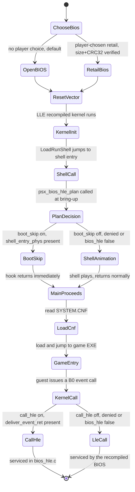

# BIOS: OpenBIOS, retail, LLE, and the HLE tier

Every PSXRecomp build links **two** statically recompiled BIOS backends —
OpenBIOS and one retail image — and always runs the recompiled kernel
underneath (**LLE**). On top sits an optional **HLE tier** (`[runtime]
bios_hle`), really two independent decisions wearing one flag. This page
covers which BIOS runs, what LLE and HLE mean here, and where the decision
is made in code.

Source:
[docs/BIOS_SELECTION.md](https://github.com/Alexbeav/psxrecomp/blob/0c4dd09a06382cc65c5e1b866fd6efdba5d77381/docs/BIOS_SELECTION.md),
[docs/ARCHITECTURE.md § "BIOS: LLE baseline + a swappable HLE tier"](https://github.com/Alexbeav/psxrecomp/blob/0c4dd09a06382cc65c5e1b866fd6efdba5d77381/docs/ARCHITECTURE.md),
[runtime/include/bios_hle.h](https://github.com/Alexbeav/psxrecomp/blob/0c4dd09a06382cc65c5e1b866fd6efdba5d77381/runtime/include/bios_hle.h)
· [`../../api/bios__hle_8h.html`](../../api/bios__hle_8h.html),
[runtime/include/bios_hle_plan.h](https://github.com/Alexbeav/psxrecomp/blob/0c4dd09a06382cc65c5e1b866fd6efdba5d77381/runtime/include/bios_hle_plan.h)
· [`../../api/bios__hle__plan_8h.html`](../../api/bios__hle__plan_8h.html).

## Two BIOS backends, one binary

Every normal build compiles in **both** OpenBIOS and exactly one retail image
(currently SCPH-1001). Which one plays is a runtime decision, not a build
flavour:

> **No BIOS chosen → OpenBIOS. A BIOS the player explicitly chose → that
> BIOS.**

A player never needs to find a BIOS dump to start playing, and never loses
the option to use their own. The images coexist in one executable because
their generated symbols are namespaced; per `docs/BIOS_SELECTION.md` they
"collide on just 22 symbols, which are namespaced per BIOS" (unverified in
code — the doc's number, not independently confirmed by grep). A developer
can require retail for a title with a verified OpenBIOS incompatibility:

```toml
[runtime]
openbios = true    # default. false = this title requires a retail BIOS.
```

This key is read only from `game.toml` and is **not** overridable from a
player's `settings.toml` — it records a developer's compatibility finding,
not a preference.

### Acceptance gate

A chosen retail BIOS is checked before it is trusted: the compiled-in
generated code was translated from one exact retail image, so a different
dump (wrong region, a bad rip) cannot be substituted without the recompiled
code executing against mismatched data. `bios_backend_for_file()` in
[`runtime/src/main.cpp`](https://github.com/Alexbeav/psxrecomp/blob/0c4dd09a06382cc65c5e1b866fd6efdba5d77381/runtime/src/main.cpp#L2344)
· [`../../api/main_8cpp.html`](../../api/main_8cpp.html) compares a
candidate file's **size and CRC32** against every linked backend's recorded
identity and returns the matching backend, or none. A SHA-256
(`image_sha256` in
[`runtime/include/psx_bios_image.h`](https://github.com/Alexbeav/psxrecomp/blob/0c4dd09a06382cc65c5e1b866fd6efdba5d77381/runtime/include/psx_bios_image.h#L62)
· [`../../api/psx__bios__image_8h.html`](../../api/psx__bios__image_8h.html))
is also recorded on `PsxBiosImageInfo`, for provenance and bug reports only
— it plays no part in the accept/reject decision. On failure: with OpenBIOS
available the player is told why and can continue on it; with OpenBIOS
disabled for the title the choice is rejected and re-prompted.

Savestates are BIOS-specific (OpenBIOS and retail lay out kernel RAM
differently) and refuse to load under a different BIOS than the one that
captured them; memory cards are unaffected. A netplay lobby settles one
ephemeral session BIOS per match, preferring OpenBIOS unless every seated
peer can run the session's retail image — see `docs/BIOS_SELECTION.md` for
the full settle rules.

## The BIOS profiles (`bios/*.toml`)

A BIOS build profile is consumed only by the recompiler
(`psxrecomp-bios --config`, `tools/regen_bios.sh`) — never by the shipping
runtime, which reads the anchors it needs from the generated C instead (see
below).

| Profile | id | Kernel anchors exported | Notes |
|---|---|---|---|
| [`bios/SCPH1001.toml`](https://github.com/Alexbeav/psxrecomp/blob/0c4dd09a06382cc65c5e1b866fd6efdba5d77381/bios/SCPH1001.toml) | `SCPH-1001` | `shell_entry_phys`, `deliver_event_ret` | Retail US v2.2; the reference/oracle image. |
| [`bios/SCPH5552.toml`](https://github.com/Alexbeav/psxrecomp/blob/0c4dd09a06382cc65c5e1b866fd6efdba5d77381/bios/SCPH5552.toml) | `SCPH-5552` | `shell_entry_phys`, `deliver_event_ret` | Retail EU v3.0; kernel is byte-identical to SCPH-1001, only the shell region differs (its own seed set, no kernel HLE anchor difference). |
| [`bios/OpenBIOS.toml`](https://github.com/Alexbeav/psxrecomp/blob/0c4dd09a06382cc65c5e1b866fd6efdba5d77381/bios/OpenBIOS.toml) | `OPENBIOS` | `shell_entry_phys` only | MIT, PCSX-Redux project, redistributable — bundled with every build. `deliver_event_ret` is deliberately omitted (see below). |

These three files are the current, authoritative schema: a
`[recompiler.address_model]` section (boot-time ROM→RAM copy windows,
`normalize_mask`) plus a `[recompiler.runtime_exports]` section (the HLE
anchors). `docs/BUILDING.md` and `docs/COMPILING_OVERLAYS.md`'s
`psxrecomp-game` error message ("Searched ... `bios/SCPH1001.toml`") both
reference profiles by this `bios/<stem>.toml` path.

(unverified whether still built/used) The repository root also has
`SCPH1001.toml`, `SCPH101.toml`, and `SCPH5552.toml`, in an older, simpler
schema — no `[recompiler.address_model]` / `[recompiler.runtime_exports]`,
and a different ROM filename convention (root `SCPH1001.toml` points at
`bios/US-PSX-SCPH1001.BIN`, not `bios/SCPH1001.BIN`). Notably, **`bios/` has
no `SCPH101.toml`**: the only SCPH-101 (PSOne) profile is the root-level
one, old schema, with no `bios/`-schema equivalent. No doc here references
the root-level copies by path, so this guide does not know whether a current
build step still consumes them; it treats `bios/*.toml` as authoritative.

OpenBIOS's own comment on the missing anchor: `deliver_event_ret` is
"deliberately ABSENT (0) until the B0 event services are validated against
this kernel's EvCB behavior" — believed compatible, not verified. That
absence is what drives the call-HLE / boot-skip split below.

OpenBIOS is MIT-licensed (PCSX-Redux project). Its notice is vendored at
[`bios/OpenBIOS.LICENSE`](https://github.com/Alexbeav/psxrecomp/blob/0c4dd09a06382cc65c5e1b866fd6efdba5d77381/bios/OpenBIOS.LICENSE)
(confirmed present), the pin/build recipe lives in `bios/OpenBIOS.toml`, and
`THIRD_PARTY_ATTRIBUTION.md` records both; a release packager must copy
`bios/` as a unit. Retail images are never shipped — a player using one
supplies their own dump.

## LLE: the recompiled BIOS *is* the kernel

The compiled-in BIOS image — retail or OpenBIOS — is translated by the same
MIPS→C pipeline as a game EXE (see [`./recompiler.md`](./recompiler.md)),
entry point
[`recompiler/src/main_bios.cpp`](https://github.com/Alexbeav/psxrecomp/blob/0c4dd09a06382cc65c5e1b866fd6efdba5d77381/recompiler/src/main_bios.cpp)
· [`../../api/main__bios_8cpp.html`](../../api/main__bios_8cpp.html). There
are no per-vector HLE shims replacing kernel code by default: the recompiled
BIOS is the reference implementation and the correctness/timing oracle
everything else is checked against. This is architecturally locked in this
repository's `CLAUDE.md` (its BIOS-HLE amendment), precisely so HLE stays
honest — every service it doesn't implement falls straight through to the
real kernel, and never becomes load-bearing beyond what it covers.

## HLE: one flag, two independent axes

`[runtime] bios_hle` (default **on**; env override `PSX_BIOS_HLE`) turns on
an optional tier that intercepts BIOS behavior in native C instead of the
recompiled kernel. It has two axes with **different per-image requirements**,
and conflating them was a real, fixed bug.

| Axis | What it does | Needs from the image | On SCPH-1001 / SCPH-5552 | On OpenBIOS |
|---|---|---|---|---|
| **boot-skip** | One-shot intercept of the first dispatch to the BIOS shell entry (RAM `0x30000`, the boot animation); returns immediately so `Main()` proceeds straight to `SYSTEM.CNF` + game EXE load, with kernel state built entirely by the real recompiled kernel init. | `shell_entry_phys` only. Works under pure LLE — nothing is synthesized. | yes | yes |
| **call-HLE** | Services a few kernel calls (the B0 `DeliverEvent` family) by computing their effect directly on guest state, instead of the recompiled BIOS. | `deliver_event_ret` — the kernel's own `DeliverEvent` return address, so a delivered callback returns through the exact `$ra` the kernel loop uses. | yes | refused, loudly (prints one line at startup) |

The boot-skip **deprecates** an older "fast_boot snapshot restore"
mechanism; `fast_boot` survives only as a deprecated alias that requests
boot-skip alone, never call-HLE.

### The 2026-07-27 bug this fixed

Until 2026-07, `main.cpp` forced the requested `bios_hle` flag to `false`
whenever the linked image had no `deliver_event_ret`, then derived
`boot_skip` from that already-mutated flag. On OpenBIOS — which exports
`shell_entry_phys` but not `deliver_event_ret` — this silently took the
boot-skip away too: choosing OpenBIOS sat the player in the boot animation
while the identical build on retail SCPH-1001 went straight to the game. One
flag meant two different things depending on a BIOS detail no player could
see. Both axes are now decided in one pure, dependency-free, unit-tested
function:

```c
--8<-- "code-docs/.engine/runtime/include/bios_hle_plan.h:45:68"
```

and its implementation:

```c
--8<-- "code-docs/.engine/runtime/src/bios_hle_plan.c:5:37"
```

Note `boot_skip` is derived from the *requested* `bios_hle` / `fast_boot`,
never from `call_hle` — refusing call-HLE on an image must never silently
cancel the player's boot-skip. `runtime/tests/test_bios_hle_plan.c` exercises
this decision matrix directly, since the function takes no `CPUState`, no
`psx_bios_image`, and touches no runtime globals.

### Wiring it up

At bring-up, `runtime/src/main.cpp` builds a `PsxBiosHleRequest` from the
resolved config/env flags and the *selected* image's anchors
(`psx_bios_image.deliver_event_ret != 0`, `psx_bios_image.shell_entry_phys
!= 0`, and whether a game EXE is loaded at all — a BIOS-only run has nothing
to skip *to*), calls `psx_bios_hle_plan()`, and passes the resulting
`call_hle` / `boot_skip` pair to `psx_bios_hle_configure(int call_hle, int
boot_skip)` in
[`runtime/src/bios_hle.c`](https://github.com/Alexbeav/psxrecomp/blob/0c4dd09a06382cc65c5e1b866fd6efdba5d77381/runtime/src/bios_hle.c#L331)
· [`../../api/bios__hle_8c.html`](../../api/bios__hle_8c.html). That function
installs (or clears) the dispatch hook `int (*g_psx_bios_hle_hook)(struct
CPUState* cpu, uint32_t phys)`, consulted at the top of every generated
dispatch iteration before any backend claims the target PC. A `NULL` hook
(both axes off) is pure LLE — byte-identical dispatch to a build with the
tier compiled out. When the hook is set and the target is a kernel service
vector (`0xA0`/`0xB0`/`0xC0`, function number in `$t1`) that is implemented,
the handler computes the effect on the real guest kernel structures (the
EvCB table etc., in guest RAM) and returns `1`, so the guest resumes at
`$ra` with no BIOS dispatch at all. Everything unimplemented falls through
untouched.

Query surface (`bios_hle.h`): `psx_bios_hle_enabled()` and
`psx_bios_hle_boot_skip_enabled()` report which axes are active,
`psx_bios_hle_backend_name()` feeds the startup banner, and
`psx_bios_hle_boot_turbo_active()` (true while the boot-skip drives the
frontend unpaced) is ORed into `main.cpp`'s turbo predicate so kernel init
and the EXE load run at host speed.

### Always-on observability

Every hook decision — serviced in HLE, fell through to LLE, or the boot-skip
firing — is recorded in an always-on ring buffer (`PsxHleCallEntry`,
capacity `PSX_HLE_RING_CAP` = 16384, routes `PSX_HLE_ROUTE_LLE` /
`PSX_HLE_ROUTE_HLE` / `PSX_HLE_ROUTE_BOOT`), queryable without arming
anything over the TCP debug server's `hle_dump` command (handler
`handle_hle_dump` in
[`runtime/src/debug_server.c`](https://github.com/Alexbeav/psxrecomp/blob/0c4dd09a06382cc65c5e1b866fd6efdba5d77381/runtime/src/debug_server.c#L3638)
· [`../../api/debug__server_8c.html`](../../api/debug__server_8c.html)).

## Boot sequence



`PlanDecision` and `KernelCall` are exactly the two axes above: identical
outcome on retail and OpenBIOS for boot-skip, image-gated for call-HLE.

## Build time: both backends, always

Every normal runtime build compiles both backends via `tools/regen_bios.sh`:

```bash
tools/regen_bios.sh --config bios/OpenBIOS.toml     # tracked, redistributable
tools/regen_bios.sh --config bios/SCPH1001.toml     # needs your own local dump
```

`PSXRECOMP_BIOS_STEMS` defaults to `OpenBIOS;SCPH1001`. The runtime build
stages `bios/openbios.bin` and `bios/OpenBIOS.LICENSE` beside every native
executable automatically; a release packager copies `bios/` unchanged. See
[`docs/BUILDING.md`](https://github.com/Alexbeav/psxrecomp/blob/0c4dd09a06382cc65c5e1b866fd6efdba5d77381/docs/BUILDING.md#L300)'s
"Regenerating BIOS backends" section for the full recipe (a fresh clone with
no `generated/<stem>_full.c` yet fails configure with `No recompiled BIOS
backend available` until this step runs). Carrying both costs roughly 20 MB
of binary size, in exchange for one build configuration and one source of
truth — the earlier per-BIOS build-flavour design let a game state its BIOS
in three uncross-checked places and link mismatched BIOS/game code that
still compiled cleanly.

## Where to go next

- [`./overview.md`](./overview.md) — the three execution tiers and directory map.
- [`./recompiler.md`](./recompiler.md) — the MIPS→C pipeline for BIOS and game EXE.
- [`./runtime.md`](./runtime.md) — every runtime subsystem, file by file.
- [`./reading-paths.md`](./reading-paths.md) — guided tours through the code.
