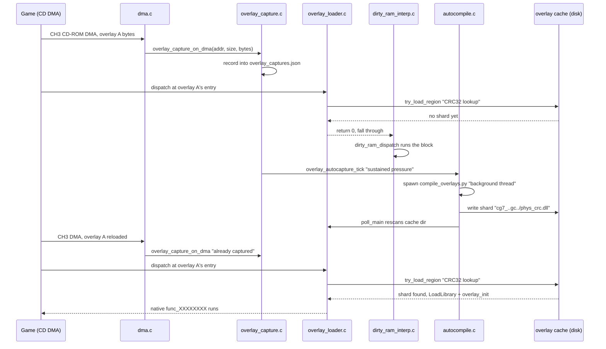

# Overlays — capture, compile, cache, dispatch

An overlay is a chunk of a PS1 game's code that does not exist anywhere at
build time. This page covers Tier 2 of the [three-tier execution
model](./overview.md#three-tiers-of-execution) in depth: how overlay bytes
are captured off the CD-ROM DMA path, compiled to native code, cached, and
dispatched into ahead of the interpreter. Tier 3, the dirty-RAM interpreter,
is covered here too, since every overlay runs on it until it is native.

Not to be confused with the **runtime settings-menu overlay** (the in-game
pause/options UI, `docs/RUNTIME_OVERLAY.md`) — same word, unrelated system.

## Why overlays exist

A PS1 game is bigger than the console's 2 MB of RAM, so a level's logic, a
boss, a menu stream from the CD into a fixed, *reused* RAM window as the
player moves through the game, then get overwritten by the next chunk. That
streamed code does not exist as a discoverable file at build time — it
appears only at a specific moment during play, and its addresses get reused
by dozens of other overlays over a playthrough. An ahead-of-time recompiler
has nothing to translate ahead of time, so PSXRecomp instead watches for the
moment an overlay loads and turns it into native code the first time it is
seen, so every later visit — this run and every future run — dispatches
straight into compiled code
([`docs/EXECUTION_MODEL.md`](https://github.com/Alexbeav/psxrecomp/blob/0c4dd09a06382cc65c5e1b866fd6efdba5d77381/docs/EXECUTION_MODEL.md)).

| Stage | What happens | Where |
|---|---|---|
| Capture | Record bytes + executed addresses the moment the game DMAs an overlay into RAM. | `overlay_capture.c` |
| Interpret (fallback) | Until native code exists, run the overlay on the dirty-RAM interpreter. | `dirty_ram_interp.c` |
| Compile | Feed captured bytes back through the same recompiler as the main EXE; compile the generated C. | `tools/compile_overlays.py`, `overlay_backend.c` |
| Cache | Store the compiled library in a content-addressed, compiler/ABI-namespaced dir. | `overlay_loader.c`, on-disk `cache/` |
| Dispatch | Find the matching cached library and call into it before falling back to the interpreter. | `overlay_loader.c` |

## Capture

`runtime/include/overlay_capture.h` / `runtime/src/overlay_capture.c` (1503
lines). [Source · API](https://github.com/Alexbeav/psxrecomp/blob/0c4dd09a06382cc65c5e1b866fd6efdba5d77381/runtime/src/overlay_capture.c) · [`../../api/overlay__capture_8c.html`](../../api/overlay__capture_8c.html)

Capture is **off by default**; it activates only when `[runtime]
overlay_cache = true` in `game.toml` (`gc.runtime.overlay_cache`, checked in
`main.cpp`, which calls
[`overlay_capture_set_enabled`](https://github.com/Alexbeav/psxrecomp/blob/0c4dd09a06382cc65c5e1b866fd6efdba5d77381/runtime/include/overlay_capture.h#L34)).
Off, `overlay_capture_on_dma()` and `overlay_capture_write_json()` are no-ops.

| Function | Role |
|---|---|
| [`overlay_capture_set_out_dir`](https://github.com/Alexbeav/psxrecomp/blob/0c4dd09a06382cc65c5e1b866fd6efdba5d77381/runtime/include/overlay_capture.h#L22) | Sets where `overlay_captures.json` is written. |
| [`overlay_capture_on_dma`](https://github.com/Alexbeav/psxrecomp/blob/0c4dd09a06382cc65c5e1b866fd6efdba5d77381/runtime/src/overlay_capture.c#L260) | Records an overlay's bytes + load address into the capture set. |
| [`overlay_capture_before_dma`](https://github.com/Alexbeav/psxrecomp/blob/0c4dd09a06382cc65c5e1b866fd6efdba5d77381/runtime/src/overlay_capture.c#L849) | Journals bytes at a RAM span *before* a DMA overwrites it, if that span had already executed. |
| [`overlay_capture_write_json`](https://github.com/Alexbeav/psxrecomp/blob/0c4dd09a06382cc65c5e1b866fd6efdba5d77381/runtime/src/overlay_capture.c#L839) | Serializes the capture set to `overlay_captures.json`; called from `shutdown_runtime()` in `main.cpp`. |
| [`overlay_capture_count`](https://github.com/Alexbeav/psxrecomp/blob/0c4dd09a06382cc65c5e1b866fd6efdba5d77381/runtime/src/overlay_capture.c#L900) | Number of distinct overlays captured this session. |
| [`overlay_autocapture_tick`](https://github.com/Alexbeav/psxrecomp/blob/0c4dd09a06382cc65c5e1b866fd6efdba5d77381/runtime/src/overlay_capture.c#L1327) / `overlay_autocapture_set_enabled` | Per-vblank trigger: on sustained interpreter pressure, fires a capture + background compile ("variant-capture automation"). |

**Where it actually fires.** The header's own phrase ("called from
`execute_ch3_cdrom()`") simplifies one hop: `execute_ch3_cdrom()`
(`dma.c`, [L825](https://github.com/Alexbeav/psxrecomp/blob/0c4dd09a06382cc65c5e1b866fd6efdba5d77381/runtime/src/dma.c#L825))
only *starts* the async CH3 transfer; the actual
[`overlay_capture_on_dma` call](https://github.com/Alexbeav/psxrecomp/blob/0c4dd09a06382cc65c5e1b866fd6efdba5d77381/runtime/src/dma.c#L499)
is in `finish_async_cdrom_transfer()`, once that transfer completes, for
forward transfers with `load_start < 0x1C0000` (0x1C0000+ is
FMV/streaming, excluded). `overlay_capture_before_dma` runs earlier in the
same transfer, right before the first RAM word lands
([`dma.c#L1132`](https://github.com/Alexbeav/psxrecomp/blob/0c4dd09a06382cc65c5e1b866fd6efdba5d77381/runtime/src/dma.c#L1132)),
snapshotting what the DMA is about to overwrite if that span already ran.

**Privacy.** `overlay_captures.json` holds snapshots of the game's own code
read from the player's disc. `docs/COMPILING_OVERLAYS.md`: *"Keep it
private — do not post it publicly."*

## The dirty-RAM interpreter (the fallback tier)

`runtime/include/dirty_ram_interp.h` / `runtime/src/dirty_ram_interp.c`
(3961 lines). [Source · API](https://github.com/Alexbeav/psxrecomp/blob/0c4dd09a06382cc65c5e1b866fd6efdba5d77381/runtime/src/dirty_ram_interp.c) · [`../../api/dirty__ram__interp_8c.html`](../../api/dirty__ram__interp_8c.html)

This tier runs an overlay in the window between "it just appeared" and "we
have native code for it." Its header is explicit about scope: *"this is NOT
a fallback for code the recompiler failed to translate... It runs only
against PCs in pages that have been written-to since boot."* Static BIOS
and main-EXE code are never on this path.

```
--8<-- "code-docs/.engine/runtime/include/dirty_ram_interp.h:25:38"
```

[Source](https://github.com/Alexbeav/psxrecomp/blob/0c4dd09a06382cc65c5e1b866fd6efdba5d77381/runtime/include/dirty_ram_interp.h#L41) ·
[definition](https://github.com/Alexbeav/psxrecomp/blob/0c4dd09a06382cc65c5e1b866fd6efdba5d77381/runtime/src/dirty_ram_interp.c#L2390).

Two phys-addressed windows are tracked: **kernel RAM** `[0x00000, 0x10000)`
(`DIRTY_RAM_KERNEL_WINDOW_END`) — the relocated BIOS part-2 image plus
install-at-runtime stubs like the SIO data-byte stub at `0xCF0` — and the
**overlay region** `[OVERLAY_REGION_FLOOR, RAM_SIZE)`, where game overlays land.

`OVERLAY_REGION_FLOOR` is a *runtime* value (`g_overlay_region_floor`), not
a constant, because it differs per game. The header: *"Tomba 1's text ends
at 0x98000 (0x10000+0x88000) but Tomba 2's boot EXE is only 0x28800 (text
ends at 0x38800). A hardcoded 0x98000 misclassified Tomba 2's overlays
(loaded at 0x85000+) as main-EXE text"* — forcing them onto the slow
per-block path instead of the overlay-cache path. `main.cpp` computes the
floor as `(load_address + text_size) & 0x1FFFFFFF` at game load;
`OVERLAY_REGION_FLOOR_DEFAULT` (`0x00098000`) applies only for BIOS-only
runs. The header notes this floor-above-text assumption itself breaks for
titles that load high and stream gameplay code below their own text
(Klonoa and others are named) — see the comment following
`OVERLAY_REGION_FLOOR` for that handling. If the interpreter is running
something, that is a signal to capture-and-compile it, not a state to stay in.

## Backend tier resolution

`runtime/include/overlay_backend.h` / `runtime/src/overlay_backend.c`.
[Source · API](https://github.com/Alexbeav/psxrecomp/blob/0c4dd09a06382cc65c5e1b866fd6efdba5d77381/runtime/src/overlay_backend.c) · [`../../api/overlay__backend_8c.html`](../../api/overlay__backend_8c.html)

This module is compiler-neutral **policy**, not the compile invocation. Its
header states the priority order plainly: **static > gcc shard > tcc shard
> interp**. `gcc` and `tcc` share one pipeline (recompiler → C → compiler →
DLL → loader); they differ only in which compiler binary the autocompile
command spawns.

```c
typedef enum {
    OVERLAY_BACKEND_AUTO        = 0, /* gcc if present, else tcc */
    OVERLAY_BACKEND_GCC         = 1, /* force spawn-gcc->DLL (dev / production shards) */
    /* value 2 was OVERLAY_BACKEND_SLJIT (removed 2026-07-15) */
    OVERLAY_BACKEND_TCC         = 3, /* spawn-tcc->DLL (bundled, toolchain-free fallback) */
    OVERLAY_BACKEND_AUTO_NO_GCC = 4  /* dev/test: AUTO but pretend no gcc toolchain */
} OverlayBackend;
```

[`overlay_backend_resolve(cfg, gcc_toolchain_available)`](https://github.com/Alexbeav/psxrecomp/blob/0c4dd09a06382cc65c5e1b866fd6efdba5d77381/runtime/src/overlay_backend.c#L42)
resolves the backend once at startup: env `PSX_OVERLAY_BACKEND` >
`game.toml [runtime] overlay_backend` > `AUTO` (both wired for real in
`main.cpp`). `AUTO` picks gcc if reachable and configured, else tcc;
`AUTO_NO_GCC` always picks tcc, simulating a toolchain-less player box.

**Historical note.** The header documents a removed tier — an in-process
`sljit` JIT provider, "removed 2026-07-15 — it mis-compiled and had been
gated off since 2026-06-25" — mentioned only so it isn't mistaken for a
current tier.

The compile production itself — spawning the command off-thread and
applying a finished compile via cache rescan — lives one layer below, in
`code_provider.c` (a backend-agnostic seam, 50 lines) and `autocompile.c`
(1234 lines, spawns `game.toml [runtime] overlay_autocompile_cmd`, no log
files per this checkout's `CLAUDE.md` §3). `docs/EXECUTION_MODEL.md`'s
directory table cites `overlay_compile_worker.c` for this role; no such
file exists in this checkout — `(unverified, per docs/EXECUTION_MODEL.md)`
— `code_provider.c` and `autocompile.c` are the files that actually fill it.

## Compiling captures into a cache

The workflow that turns `overlay_captures.json` into shippable coverage is
`tools/compile_overlays.py`
([Source · API](https://github.com/Alexbeav/psxrecomp/blob/0c4dd09a06382cc65c5e1b866fd6efdba5d77381/tools/compile_overlays.py) · [`../../api/compile__overlays_8py.html`](../../api/compile__overlays_8py.html)),
6698 lines, covered here at the level of
[`docs/COMPILING_OVERLAYS.md`](https://github.com/Alexbeav/psxrecomp/blob/0c4dd09a06382cc65c5e1b866fd6efdba5d77381/docs/COMPILING_OVERLAYS.md) —
the story, not every flag (see [`./tools.md`](./tools.md) for the CLI).

Play with `overlay_cache = true` to accumulate captures, pre-build a
gcc-optimized cache (`--gcc`), and ship that `cache/` folder — gcc gives the
best-optimized code and a native first visit. The runtime's own background
autocompile is **a fallback that fills gaps, not the plan**: on a box with
no toolchain it falls back to a bundled, self-contained
`overlay_toolchain/` (embedded Python + TinyCC + the recompiler + this
script + headers), which keeps players unstuck but optimizes worse than gcc.

Two output modes: the default **DLL cache** — per-region `.dll` shards in a
content-addressed dir the loader rescans, growing with play (`--captures`,
`--game-toml`, `--recompiler`, `--runtime-include`, `--out-dir`, `--gcc` /
`--compiler tcc`, `--cps`, `--jobs`, `--force`) — and **`--static`**, which
bakes every captured overlay into one C file, `generated/overlays_static.c`
(every `func_XXXXXXXX` plus an auto-generated `psx_overlay_dispatch()`
switch), linked into the runtime binary as a fixed build-time snapshot.

**Staleness guard.** The recompiler binary and codegen source are tied by a
hash: the script runs `psxrecomp-game.exe --codegen-hash` and compares it
to the hash baked into `--runtime-include`, aborting on a mismatch rather
than silently emitting shards against stale semantics. Fix: rebuild
`psxrecomp-game` from the current tree.

Confirmed present in source: `codegen_ver` ([L57](https://github.com/Alexbeav/psxrecomp/blob/0c4dd09a06382cc65c5e1b866fd6efdba5d77381/tools/compile_overlays.py#L57)), `codegen_hash` ([L95](https://github.com/Alexbeav/psxrecomp/blob/0c4dd09a06382cc65c5e1b866fd6efdba5d77381/tools/compile_overlays.py#L95)), `verify_recompiler_matches_tag` ([L112](https://github.com/Alexbeav/psxrecomp/blob/0c4dd09a06382cc65c5e1b866fd6efdba5d77381/tools/compile_overlays.py#L112)), and `generate_overlay_dispatch` ([L2259](https://github.com/Alexbeav/psxrecomp/blob/0c4dd09a06382cc65c5e1b866fd6efdba5d77381/tools/compile_overlays.py#L2259)).
A `--check` preflight mode builds every shard into a throwaway dir and
reports `PSX_SHARD_RESULT ok=N failed=M skipped=K` without touching the
real cache.

## Cache and dispatch

`runtime/include/overlay_loader.h` / `runtime/src/overlay_loader.c` (4815
lines). [Source · API](https://github.com/Alexbeav/psxrecomp/blob/0c4dd09a06382cc65c5e1b866fd6efdba5d77381/runtime/src/overlay_loader.c) · [`../../api/overlay__loader_8c.html`](../../api/overlay__loader_8c.html)

```
--8<-- "code-docs/.engine/runtime/include/overlay_loader.h:3:13"
```

[Source](https://github.com/Alexbeav/psxrecomp/blob/0c4dd09a06382cc65c5e1b866fd6efdba5d77381/runtime/include/overlay_loader.h#L4).
One detail this simplifies, worth stating precisely since the code moved
on: it describes the cache check as eager, at DMA completion. In current
source,
[`overlay_loader_check_cache`](https://github.com/Alexbeav/psxrecomp/blob/0c4dd09a06382cc65c5e1b866fd6efdba5d77381/runtime/src/overlay_loader.c#L2818)
(still called from `overlay_capture_on_dma`) is a deliberate no-op —
*"DLL loading is deferred to the first dispatch miss (`try_load_region`)."*
The real check happens lazily inside
[`overlay_loader_dispatch`](https://github.com/Alexbeav/psxrecomp/blob/0c4dd09a06382cc65c5e1b866fd6efdba5d77381/runtime/src/overlay_loader.c#L3498),
the first time the guest PC lands in that overlay's region: `try_load_region`
(`overlay_loader.c#L3276`) computes a CRC32 over the live overlay bytes,
matches it against indexed candidates, and only then calls `LoadLibraryA` +
`GetProcAddress` for `overlay_abi`, `overlay_pair_id`, `overlay_init`, and
each `func_%08X` export, registering them in the dispatch table.

| Function | Role |
|---|---|
| [`overlay_loader_init`](https://github.com/Alexbeav/psxrecomp/blob/0c4dd09a06382cc65c5e1b866fd6efdba5d77381/runtime/src/overlay_loader.c#L2680) | Sets the cache root, game id, config hash at game handoff. |
| [`overlay_loader_dispatch`](https://github.com/Alexbeav/psxrecomp/blob/0c4dd09a06382cc65c5e1b866fd6efdba5d77381/runtime/src/overlay_loader.c#L3498) | Returns 1 and calls the compiled function if registered for `addr`; 0 falls through to the interpreter. `dirty_ram_dispatch` calls this first. |
| [`overlay_loader_registered_count`](https://github.com/Alexbeav/psxrecomp/blob/0c4dd09a06382cc65c5e1b866fd6efdba5d77381/runtime/src/overlay_loader.c#L3934) | Number of native functions currently registered. |
| [`overlay_loader_get_status`](https://github.com/Alexbeav/psxrecomp/blob/0c4dd09a06382cc65c5e1b866fd6efdba5d77381/runtime/src/overlay_loader.c#L4796) | Snapshot of loader state for the TCP debug server. |

**Cache path shape** — namespaced so games, compilers, architectures, and
codegen versions never collide:

```
--8<-- "code-docs/.engine/runtime/src/overlay_loader.c:1904:1912"
```

[Source](https://github.com/Alexbeav/psxrecomp/blob/0c4dd09a06382cc65c5e1b866fd6efdba5d77381/runtime/src/overlay_loader.c#L1904).
`docs/COMPILING_OVERLAYS.md` documents the shape as
`<out-dir>/<game-id>/<gcc|tcc>/<os>-<arch>/cg<N>_<hash>/<phys>_<crc>.dll`
(e.g. `cache/SLUS-01395/gcc/win-x64/cg7_1a2b3c4d/000E7000_B476006F.dll`),
correct at the top level. In source the `cg<N>_<hash>` segment is actually
`cg<N>_<codegen-hash>_gc<config-hash>_f<flavor>` — two more namespace
components (a hash of the resolved `[runtime]` config, and a build flavor)
folded in, so a cache built against one runtime config is not picked up by
a differently configured build of the same game.

**gcc beats tcc for the same region** — verified in source, not only in
`docs/ARCHITECTURE.md`: `overlay_loader.c` keys candidates by a numeric
`tier` (`CACHE_TIER_TCC = 1`, `CACHE_TIER_GCC = 2`) and prefers the higher
value in every comparison (e.g. `overlay_loader.c#L3455`), so a gcc shard
always wins over a tcc shard for the same region, independent of scan order.

## Sequence: two overlay loads

The first time overlay `A` loads, nothing native exists yet, so it runs on
the interpreter while capture and a background compile happen. The second
time it loads — or once the compile finishes and a rescan picks it up — the
loader finds the cached library and dispatches straight into native code.



## Where to go next

- [`./overview.md`](./overview.md) — the three-tier model, one level up.
- [`./runtime.md`](./runtime.md) — every runtime subsystem, file by file.
- [`./tools.md`](./tools.md) — `compile_overlays.py`'s full CLI reference.
- [`./bios-tiers.md`](./bios-tiers.md) — the unrelated static/HLE split for the BIOS.
- [`./reading-paths.md`](./reading-paths.md) — guided tours through the code.
