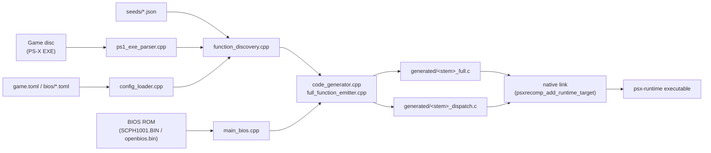
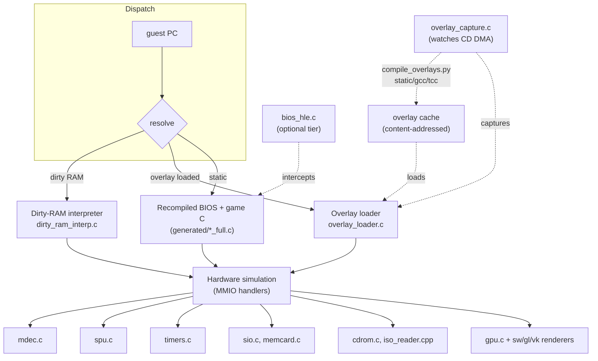

# Engine overview

PSXRecomp turns a PlayStation 1 game into a native program by statically
translating its MIPS R3000A machine code to C ahead of time, then filling the
two gaps a pure ahead-of-time translation can't cover — code streamed in at
runtime, and code rewritten at runtime — with a runtime compiler and a small
interpreter. The result runs mostly as compiled C, gets faster the longer a
game is played, and is never wrong: anything not yet native still runs, just
slower.

The project is two separate CMake trees that talk to each other through
generated C, not shared process state: the **recompiler** (an offline tool)
and the **runtime** (the engine that links the recompiler's output and
simulates the PS1's hardware around it). A third piece, **`host/`**, is the
portable "Generate & rebuild" glue that lets a shipped title regenerate its
own game C from a player's disc.

Source:
[docs/ARCHITECTURE.md](https://github.com/Alexbeav/psxrecomp/blob/0c4dd09a06382cc65c5e1b866fd6efdba5d77381/docs/ARCHITECTURE.md),
[docs/EXECUTION_MODEL.md](https://github.com/Alexbeav/psxrecomp/blob/0c4dd09a06382cc65c5e1b866fd6efdba5d77381/docs/EXECUTION_MODEL.md).

## Three tiers of execution

A PS1 game is bigger than the console's 2 MB of RAM, so games stream code off
the disc as they run — a level's logic, a boss, a menu, loaded into a reused
RAM window and later overwritten by the next chunk (an **overlay**). The main
`PS-X EXE` and the BIOS exist on disc/ROM at build time and can be fully
translated; an overlay's bytes don't exist anywhere until the moment the game
loads them. PSXRecomp resolves a guest program counter through three tiers,
in strict priority order, so the system can only ever fail *slow*, never
*wrong*:

1. **Static (AOT) recompilation.** At build time the recompiler translates
   the BIOS ROM and the game's main EXE into C, function by function. This
   compiled code is the overwhelming majority of what executes — boot, the
   main loop, most gameplay systems — and runs as fast as the C compiler can
   make it.
2. **Native overlays (capture-and-compile).** The runtime watches every CD
   DMA into the overlay RAM window, records the bytes and the addresses
   actually executed
   ([`runtime/src/overlay_capture.c`](https://github.com/Alexbeav/psxrecomp/blob/0c4dd09a06382cc65c5e1b866fd6efdba5d77381/runtime/src/overlay_capture.c)),
   and feeds captured overlays back through the *same* recompiler
   ([`tools/compile_overlays.py`](https://github.com/Alexbeav/psxrecomp/blob/0c4dd09a06382cc65c5e1b866fd6efdba5d77381/tools/compile_overlays.py)).
   The resulting native library is cached and dispatched into on every later
   visit
   ([`runtime/src/overlay_loader.c`](https://github.com/Alexbeav/psxrecomp/blob/0c4dd09a06382cc65c5e1b866fd6efdba5d77381/runtime/src/overlay_loader.c)).
3. **The dirty-RAM interpreter — a correctness safety net.** Code that has
   never been captured yet, or that is rewritten to different bytes on every
   load (self-modifying / per-load relocated code, which has no single
   ahead-of-time translation), runs on a small MIPS interpreter
   ([`runtime/src/dirty_ram_interp.c`](https://github.com/Alexbeav/psxrecomp/blob/0c4dd09a06382cc65c5e1b866fd6efdba5d77381/runtime/src/dirty_ram_interp.c)).
   It executes the game's own instructions directly — this is not
   high-level emulation, only the *source* of the instructions differs
   (RAM-at-runtime vs. ROM-at-build-time). It is deliberately narrow: it
   never runs BIOS or main-EXE code, only RAM that has been written to since
   boot.

Independently of these three tiers, the BIOS itself has two axes: it is
always the recompiled LLE (low-level emulation) kernel underneath, and
optionally an **HLE tier** (`[runtime] bios_hle`, on by default) that skips
the boot sequence and services a few kernel calls directly, always falling
through to the recompiled BIOS for anything it doesn't implement. See
[`./bios-tiers.md`](./bios-tiers.md).

## Build-time pipeline

## Run-time architecture

## Directory map

| Directory | Purpose | Key files |
|---|---|---|
| `recompiler/src`, `recompiler/include` | The MIPS→C offline translator (C++20): decode, CFG, function discovery, codegen. | `mips_decoder.cpp`, `control_flow.cpp`, `function_discovery.cpp`, `code_generator.cpp`, `full_function_emitter.cpp`, `strict_translator.cpp`. [Source · API](https://github.com/Alexbeav/psxrecomp/blob/0c4dd09a06382cc65c5e1b866fd6efdba5d77381/recompiler/src/code_generator.cpp) · [`../../api/code__generator_8cpp.html`](../../api/code__generator_8cpp.html) |
| `recompiler/src/main_*.cpp` | Recompiler entry points sharing the translation core. | `main_bios.cpp` (BIOS ROM), `main_psx.cpp` (game EXE), `main_analyze.cpp` (`psxrecomp-analyze`), `main_cli.cpp`, `main_toml.cpp`. |
| `recompiler/seeds` | Function-discovery seed lists (JSON), one per BIOS/game image. | `phase2_ghidra_seeds.json`, `openbios_elf_seeds.json`. |
| `recompiler/lib` | Vendored third-party dependencies — mention only, not framework code. | `fmt`, `ELFIO`, `toml11`, `rabbitizer`. |
| `recompiler/tests` | Recompiler unit/CTest suite (38 tests per `docs/BUILDING.md`). | — |
| `runtime/src`, `runtime/include` | The engine: CPU dispatch, memory map, hardware simulation, overlay system, BIOS tiers, netplay. ~160k lines of C/C++. | See [`./runtime.md`](./runtime.md). |
| `runtime/tests` | Runtime unit tests, e.g. `test_bios_hle_plan.c`. | — |
| `runtime/shaders` | GL/Vulkan shader sources for the hardware renderers. | — |
| `runtime/third_party` | Vendored runtime-only dependency (`stb_image.h`). | — |
| `runtime/runtime.cmake` | CMake helpers a game's `CMakeLists.txt` calls to assemble the runtime target. | `psxrecomp_add_runtime_target()`, `psxrecomp_add_game_runtime()`. [Source](https://github.com/Alexbeav/psxrecomp/blob/0c4dd09a06382cc65c5e1b866fd6efdba5d77381/runtime/runtime.cmake) |
| `host/` | Portable "Generate & rebuild" host glue for setup-host titles (no game C linked). | `psxrecomp_codegen_host.c/.h`. [Source · API](https://github.com/Alexbeav/psxrecomp/blob/0c4dd09a06382cc65c5e1b866fd6efdba5d77381/host/psxrecomp_codegen_host.c) · [`../../api/psxrecomp__codegen__host_8c.html`](../../api/psxrecomp__codegen__host_8c.html) |
| `tools/` | Python tooling: overlay compilation, project scaffolding, CI, and a large set of ad-hoc debug/analysis scripts (many prefixed `_`). | `compile_overlays.py`, `new_project_layout/`, `ci/`. See [`./tools.md`](./tools.md). |
| `psxrecomp_cli.py` (repo root) | The Generate/rebuild/verify-disc CLI used by setup-host titles and `recomp-ui`. | See [`./tools.md`](./tools.md). |
| `bios/` | Tracked BIOS build **profiles** (`*.toml`) plus the bundled, redistributable OpenBIOS image. Retail dumps are never tracked. | `OpenBIOS.toml`, `SCPH1001.toml`, `SCPH5552.toml`, `openbios.bin`. See [`./bios-tiers.md`](./bios-tiers.md). |
| `cmake/` | Toolchain and dependency-archive CMake modules. | `toolchain-mingw-w64.cmake`, `psx_dependency_archive.cmake`. |
| `mods/` | Built-in mod packages (widescreen/bezel/speed style host-side mods), separate from game-specific overlays. | `mods/builtin/`. |
| `third_party/` | Vendored dependency archives fetched/staged for offline builds (e.g. `libchdr`). | — |
| `docs/` | The engine's own design docs — the primary source for this guide. | `ARCHITECTURE.md`, `EXECUTION_MODEL.md`, `BIOS_SELECTION.md`, `FUNCTION_DISCOVERY.md`. |

Two root-level directories are development artifacts rather than
architecture and are not covered further here: `accuracy/` (oracle
comparison output) and loose `*.mcd`/`*.mcr` files (sample memory-card
images used in local testing).

## Two config layers that are never merged

A **game config** (`game.toml`) configures a title at both build time
(recompiler seeds, address model) and run time (`[runtime]` keys). A **BIOS
config** (`bios/*.toml`) describes a BIOS image's identity and address
model and is consumed only by the recompiler and by `tools/regen_bios.sh` —
the shipping runtime never loads it (`runtime/src/main.cpp` has no call to
`load_bios_config`, per
[`docs/ARCHITECTURE.md`](https://github.com/Alexbeav/psxrecomp/blob/0c4dd09a06382cc65c5e1b866fd6efdba5d77381/docs/ARCHITECTURE.md)).
`[runtime]` behavior therefore comes only from `game.toml`, `settings.toml`,
the CLI, and the environment.

(unverified) Root-level `SCPH1001.toml`, `SCPH101.toml`, and `SCPH5552.toml`
also exist at the repository root, in an older, simpler schema than the ones
in `bios/` (no `[recompiler.address_model]` or `[recompiler.runtime_exports]`
sections). `docs/BUILDING.md` and `docs/COMPILING_OVERLAYS.md` only ever
reference `bios/<stem>.toml`; this guide treats `bios/*.toml` as the
authoritative profiles and does not know whether the root-level copies are
still consumed anywhere.

## Where to go next

- [`./recompiler.md`](./recompiler.md) — the MIPS→C pipeline in detail.
- [`./runtime.md`](./runtime.md) — every runtime subsystem, file by file.
- [`./bios-tiers.md`](./bios-tiers.md) — OpenBIOS vs. retail, LLE vs. HLE.
- [`./overlays.md`](./overlays.md) — capture, compile, cache, dispatch.
- [`./tools.md`](./tools.md) — the Python tooling and how it chains.
- [`./reading-paths.md`](./reading-paths.md) — guided tours through the code.
