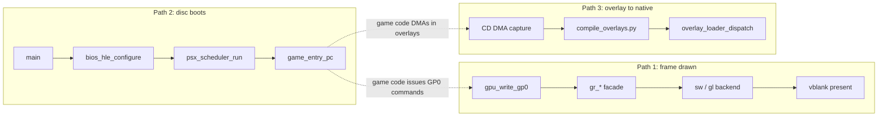

# Reading paths

This page is a navigation index, not a tutorial. Each path below is a sequence of
`file:function` stops, in the order to actually read them, with one sentence on why
each stop matters. Every stop is a real symbol, grep-confirmed against the engine
checkout pinned at commit
[`0c4dd09a`](https://github.com/Alexbeav/psxrecomp/tree/0c4dd09a06382cc65c5e1b866fd6efdba5d77381)
(2026-08-31). Click a stop's link to jump straight to that line on GitHub; the first
time a file is named on this page it also links to its Doxygen API reference page.

For the systems these paths cut across, see [Overview](./overview.md),
[Runtime](./runtime.md), [Recompiler](./recompiler.md), [BIOS tiers](./bios-tiers.md),
[Overlays](./overlays.md), and [Tools](./tools.md).

## Path 1 — How a frame is drawn

GP0/GP1 commands arrive over DMA or direct MMIO writes, `gpu.c` interprets them into
primitives, a renderer facade routes each primitive to whichever backend is active,
and the vblank callback reads the finished frame back out to the window. Read these in
order to follow one GP0 command all the way from the wire to pixels on screen.

1. [`runtime/src/dma.c:execute_ch2_gpu`](https://github.com/Alexbeav/psxrecomp/blob/0c4dd09a06382cc65c5e1b866fd6efdba5d77381/runtime/src/dma.c#L656) — [(dma.c doc)](../../api/dma_8c.html)
   DMA channel 2 (GPU) is the usual way a game streams a whole display list into the GPU, feeding each word to `gpu_write_gp0()` in a tight loop.
2. [`runtime/include/gpu.h:gpu_write_gp0`](https://github.com/Alexbeav/psxrecomp/blob/0c4dd09a06382cc65c5e1b866fd6efdba5d77381/runtime/include/gpu.h#L21) — [(gpu.h doc)](../../api/gpu_8h.html)
   this is also the direct MMIO entry point at 0x1F801810, the single funnel every GP0 command — DMA-fed or CPU-written — passes through.
3. [`runtime/src/gpu.c:gpu_write_gp0_body`](https://github.com/Alexbeav/psxrecomp/blob/0c4dd09a06382cc65c5e1b866fd6efdba5d77381/runtime/src/gpu.c#L5294) — [(gpu.c doc)](../../api/gpu_8c.html)
   the GP0 state machine: it buffers a command's words and, once the word count for that opcode is satisfied, hands off to the primitive's `gp0_exec_*` handler.
4. [`runtime/src/gpu.c:gp0_exec_mono_tri`](https://github.com/Alexbeav/psxrecomp/blob/0c4dd09a06382cc65c5e1b866fd6efdba5d77381/runtime/src/gpu.c#L3581)
   one concrete primitive handler (GP0 0x20–0x23, flat-shaded triangle): it turns raw command words into clipped vertices and draw state, then calls the renderer facade.
5. [`runtime/include/gpu_render.h`](https://github.com/Alexbeav/psxrecomp/blob/0c4dd09a06382cc65c5e1b866fd6efdba5d77381/runtime/include/gpu_render.h#L1) — [(gpu_render.h doc)](../../api/gpu__render_8h.html)
   the facade's contract: `gr_*` entry points that `gpu.c` and `main.cpp` call instead of ever naming a specific backend directly.
6. [`runtime/src/gpu_render.c:gr_draw_flat_triangle`](https://github.com/Alexbeav/psxrecomp/blob/0c4dd09a06382cc65c5e1b866fd6efdba5d77381/runtime/src/gpu_render.c#L117) — [(gpu_render.c doc)](../../api/gpu__render_8c.html)
   the facade's implementation: it forwards the call through a backend vtable (`g_b`) chosen once at startup by `gr_set_backend()`.
7. [`runtime/src/gpu_sw_renderer.c:sw_draw_flat_triangle`](https://github.com/Alexbeav/psxrecomp/blob/0c4dd09a06382cc65c5e1b866fd6efdba5d77381/runtime/src/gpu_sw_renderer.c#L744) — [(gpu_sw_renderer.c doc)](../../api/gpu__sw__renderer_8c.html)
   the default/fallback backend: this is where the triangle is actually rasterized into the CPU-side VRAM buffer (the OpenGL backend's matching vtable entry lives in [`gpu_gl_renderer.c`](../../api/gpu__gl__renderer_8c.html), wired into the same table).
8. [`runtime/src/gpu.c:gpu_vblank_tick`](https://github.com/Alexbeav/psxrecomp/blob/0c4dd09a06382cc65c5e1b866fd6efdba5d77381/runtime/src/gpu.c#L2934)
   frame end: toggles the interlace field, raises `IRQ_VBLANK`, and invokes the registered vblank callback — the signal that a frame's drawing is over.
9. [`runtime/src/main.cpp:sdl_vblank_present_body`](https://github.com/Alexbeav/psxrecomp/blob/0c4dd09a06382cc65c5e1b866fd6efdba5d77381/runtime/src/main.cpp#L6698) — [(main.cpp doc)](../../api/main_8cpp.html)
   registered as the vblank callback via `gpu_set_vblank_callback(sdl_vblank_present)` at [main.cpp:14012](https://github.com/Alexbeav/psxrecomp/blob/0c4dd09a06382cc65c5e1b866fd6efdba5d77381/runtime/src/main.cpp#L14012); this is where the finished frame gets read out and presented.
10. [`runtime/src/main.cpp` present call site](https://github.com/Alexbeav/psxrecomp/blob/0c4dd09a06382cc65c5e1b866fd6efdba5d77381/runtime/src/main.cpp#L7602)
    calls `gr_render_display_hires()` (the facade again) to fill the SDL pixel buffer from `gpu_get_display_info()`'s reported display window, then `SDL_RenderPresent()` at [main.cpp:7849](https://github.com/Alexbeav/psxrecomp/blob/0c4dd09a06382cc65c5e1b866fd6efdba5d77381/runtime/src/main.cpp#L7849) puts the pixels on screen.

## Path 2 — How a disc boots

Process entry loads the per-title config, decides per BIOS-image how much of the boot
sequence to emulate at a high level (HLE) versus run instruction-by-instruction (LLE),
then hands off to the recompiled BIOS's own dispatch loop — which is what actually
reaches the game's entry point. This path spans the runtime and the recompiler, since
the dispatch trampoline the runtime calls into is generated code shaped at build time.

1. [`runtime/src/main.cpp:main`](https://github.com/Alexbeav/psxrecomp/blob/0c4dd09a06382cc65c5e1b866fd6efdba5d77381/runtime/src/main.cpp#L11250)
   process entry.
2. [`runtime/src/main.cpp` `game_entry_pc = gc.entry_pc`](https://github.com/Alexbeav/psxrecomp/blob/0c4dd09a06382cc65c5e1b866fd6efdba5d77381/runtime/src/main.cpp#L11852)
   loads the title's `game.toml` config (the `load_game_config()` call itself is at [main.cpp:11528](https://github.com/Alexbeav/psxrecomp/blob/0c4dd09a06382cc65c5e1b866fd6efdba5d77381/runtime/src/main.cpp#L11528)), which carries the recompiled game's known entry PC as ground truth for everything below.
3. [`runtime/src/main.cpp:arm_text_image_guard`](https://github.com/Alexbeav/psxrecomp/blob/0c4dd09a06382cc65c5e1b866fd6efdba5d77381/runtime/src/main.cpp#L232) (called at [line 13604](https://github.com/Alexbeav/psxrecomp/blob/0c4dd09a06382cc65c5e1b866fd6efdba5d77381/runtime/src/main.cpp#L13604))
   as a fallback when the local EXE isn't available, this parses the disc's `SYSTEM.CNF` `BOOT =` token to locate the true boot EXE bytes and registers them for the dirty-RAM text-image integrity guard.
4. [`runtime/include/bios_hle_plan.h:psx_bios_hle_plan`](https://github.com/Alexbeav/psxrecomp/blob/0c4dd09a06382cc65c5e1b866fd6efdba5d77381/runtime/include/bios_hle_plan.h#L68) — [(bios_hle_plan.h doc)](../../api/bios__hle__plan_8h.html)
   the single place that decides, per BIOS image, whether kernel calls run through HLE and whether the boot shell/intro is skipped, based on what that image's recompile actually exposes (`deliver_event_ret`, `shell_entry_phys`).
5. [`runtime/include/bios_hle.h:psx_bios_hle_configure`](https://github.com/Alexbeav/psxrecomp/blob/0c4dd09a06382cc65c5e1b866fd6efdba5d77381/runtime/include/bios_hle.h#L77) (called at [main.cpp:14179](https://github.com/Alexbeav/psxrecomp/blob/0c4dd09a06382cc65c5e1b866fd6efdba5d77381/runtime/src/main.cpp#L14179)) — [(bios_hle.h doc)](../../api/bios__hle_8h.html)
   applies that plan by installing (or clearing) the dispatch hook `g_psx_bios_hle_hook`.
6. [`recompiler/src/full_function_emitter.cpp` dispatch trampoline emission](https://github.com/Alexbeav/psxrecomp/blob/0c4dd09a06382cc65c5e1b866fd6efdba5d77381/recompiler/src/full_function_emitter.cpp#L2014) — [(full_function_emitter.cpp doc)](../../api/full__function__emitter_8cpp.html)
   this offline codegen shapes the `psx_dispatch_impl` trampoline that every recompiled BIOS ships, including the exact `g_psx_bios_hle_hook` check (emitted at [lines 2041–2042](https://github.com/Alexbeav/psxrecomp/blob/0c4dd09a06382cc65c5e1b866fd6efdba5d77381/recompiler/src/full_function_emitter.cpp#L2041)) that lets step 5's decision actually take effect at runtime.
7. [`recompiler/src/main_bios.cpp`](https://github.com/Alexbeav/psxrecomp/blob/0c4dd09a06382cc65c5e1b866fd6efdba5d77381/recompiler/src/main_bios.cpp#L1) — [(main_bios.cpp doc)](../../api/main__bios_8cpp.html)
   the offline tool that walks a BIOS ROM's boot slice and emits `generated/boot_slice.c` through this same emitter; `generated/` is build output and is not part of this source checkout, so this is the closest pointer to where that recompiled BIOS C actually comes from.
8. [`runtime/src/psx_bios_backend.c:psx_dispatch`](https://github.com/Alexbeav/psxrecomp/blob/0c4dd09a06382cc65c5e1b866fd6efdba5d77381/runtime/src/psx_bios_backend.c#L45) — [(psx_bios_backend.c doc)](../../api/psx__bios__backend_8c.html)
   at runtime this forwards straight to whichever recompiled BIOS backend was selected (`psx_bios_active->dispatch`) — the generated `psx_dispatch_impl` from steps 6–7, now linked into the build.
9. [`runtime/src/traps.c:psx_scheduler_run`](https://github.com/Alexbeav/psxrecomp/blob/0c4dd09a06382cc65c5e1b866fd6efdba5d77381/runtime/src/traps.c#L883) (called at [main.cpp:14451](https://github.com/Alexbeav/psxrecomp/blob/0c4dd09a06382cc65c5e1b866fd6efdba5d77381/runtime/src/main.cpp#L14451)) — [(psx_scheduler.h doc)](../../api/psx__scheduler_8h.html)
   the main run loop; each step calls `psx_dispatch(cpu, run_pc)` at [traps.c:997](https://github.com/Alexbeav/psxrecomp/blob/0c4dd09a06382cc65c5e1b866fd6efdba5d77381/runtime/src/traps.c#L997), which is what actually starts executing the BIOS's reset-vector code.
10. [`runtime/src/bios_hle.c:hle_boot_shell_skip`](https://github.com/Alexbeav/psxrecomp/blob/0c4dd09a06382cc65c5e1b866fd6efdba5d77381/runtime/src/bios_hle.c#L287) — [(bios_hle.c doc)](../../api/bios__hle_8c.html)
    when boot-skip is armed, this intercepts the shell entry point and returns as if the shell had exited immediately, so BIOS `Main()` proceeds — inside the recompiled BIOS's own code, not this runtime — straight to parsing `SYSTEM.CNF` and loading the game EXE at `game_entry_pc`.

## Path 3 — How an overlay becomes native code

An overlay is code the game DMAs in from the CD after boot — dynamically loaded
content the static recompile never saw ahead of time. The runtime captures those
bytes, an offline tool recompiles them into a native DLL, and a loader swaps native
execution in for the interpreter the next time that same code runs.

1. [`runtime/src/dma.c:execute_ch3_cdrom`](https://github.com/Alexbeav/psxrecomp/blob/0c4dd09a06382cc65c5e1b866fd6efdba5d77381/runtime/src/dma.c#L825)
   CD DMA (channel 3, to RAM) is how overlay code arrives on the bus; this starts the async CD→RAM transfer.
2. [`runtime/src/dma.c:finish_async_cdrom_transfer`](https://github.com/Alexbeav/psxrecomp/blob/0c4dd09a06382cc65c5e1b866fd6efdba5d77381/runtime/src/dma.c#L476)
   once that async transfer completes, for a non-FMV, post-game-handoff data load, this is what actually calls `overlay_capture_on_dma()` with the freshly-loaded bytes, at [dma.c:499](https://github.com/Alexbeav/psxrecomp/blob/0c4dd09a06382cc65c5e1b866fd6efdba5d77381/runtime/src/dma.c#L499).
3. [`runtime/include/overlay_capture.h:overlay_capture_on_dma`](https://github.com/Alexbeav/psxrecomp/blob/0c4dd09a06382cc65c5e1b866fd6efdba5d77381/runtime/include/overlay_capture.h#L47) — [(overlay_capture.h doc)](../../api/overlay__capture_8h.html)
   records the captured bytes into the write-once capture set (implementation at [overlay_capture.c:260](https://github.com/Alexbeav/psxrecomp/blob/0c4dd09a06382cc65c5e1b866fd6efdba5d77381/runtime/src/overlay_capture.c#L260)), and in the same call checks whether a compiled DLL already exists for this load address.
4. [`runtime/include/overlay_capture.h:overlay_capture_write_json`](https://github.com/Alexbeav/psxrecomp/blob/0c4dd09a06382cc65c5e1b866fd6efdba5d77381/runtime/include/overlay_capture.h#L57) (called at [main.cpp:2921](https://github.com/Alexbeav/psxrecomp/blob/0c4dd09a06382cc65c5e1b866fd6efdba5d77381/runtime/src/main.cpp#L2921))
   persists the current capture set to `overlay_captures.json` so the offline compiler has something to read.
5. [`tools/compile_overlays.py`](https://github.com/Alexbeav/psxrecomp/blob/0c4dd09a06382cc65c5e1b866fd6efdba5d77381/tools/compile_overlays.py#L1) — [(tools reference)](./tools.md)
   the offline step, run outside the emulator: reads `overlay_captures.json`, recompiles each captured region to C the same way the static recompiler does, and builds it into a native DLL.
6. [`runtime/include/overlay_loader.h:overlay_loader_check_cache`](https://github.com/Alexbeav/psxrecomp/blob/0c4dd09a06382cc65c5e1b866fd6efdba5d77381/runtime/include/overlay_loader.h#L38) (called from `overlay_capture_on_dma`, e.g. [overlay_capture.c:292](https://github.com/Alexbeav/psxrecomp/blob/0c4dd09a06382cc65c5e1b866fd6efdba5d77381/runtime/src/overlay_capture.c#L292)) — [(overlay_loader.h doc)](../../api/overlay__loader_8h.html)
   on the next capture of the same bytes, checks whether `compile_overlays.py` has since produced a matching DLL and, if so, loads it.
7. [`runtime/src/dirty_ram_interp.c:dirty_ram_dispatch`](https://github.com/Alexbeav/psxrecomp/blob/0c4dd09a06382cc65c5e1b866fd6efdba5d77381/runtime/src/dirty_ram_interp.c#L2390) — [(dirty_ram_interp.c doc)](../../api/dirty__ram__interp_8c.html)
   the interpreter fallback for RAM-resident (dynamically loaded) code; before interpreting an address it reaches, it calls `overlay_loader_dispatch()` (confirmed at [dirty_ram_interp.c:2854–2855](https://github.com/Alexbeav/psxrecomp/blob/0c4dd09a06382cc65c5e1b866fd6efdba5d77381/runtime/src/dirty_ram_interp.c#L2854)) to give a compiled overlay first refusal, matching the ordering documented in `overlay_loader.h`.
8. [`runtime/include/overlay_loader.h:overlay_loader_dispatch`](https://github.com/Alexbeav/psxrecomp/blob/0c4dd09a06382cc65c5e1b866fd6efdba5d77381/runtime/include/overlay_loader.h#L44) (implementation at [overlay_loader.c:3498](https://github.com/Alexbeav/psxrecomp/blob/0c4dd09a06382cc65c5e1b866fd6efdba5d77381/runtime/src/overlay_loader.c#L3498))
   the actual native-vs-interpreter decision: if a loaded DLL covers this address it jumps straight into native code; otherwise it returns and `dirty_ram_dispatch` falls through to word-by-word interpretation — the loop the whole pipeline exists to escape.

## How the three paths relate

Path 2 ends where the other two begin: once the game's own recompiled code is
running, it is both the source of the GP0 commands Path 1 traces and the code that
DMAs in the overlays Path 3 captures. Reading Path 2 first, then either of the
other two, tends to make the most sense — but each stands on its own if you already
know how the runtime gets past boot.

## Notes on scope

These paths intentionally skip the parts of each system that don't change the
end-to-end story: `gpu.c`'s many other `gp0_exec_*` primitive handlers (lines, rects,
sprites, VRAM-to-VRAM copies) all reach the facade the same way `gp0_exec_mono_tri`
does; the BIOS HLE layer services far more kernel calls than the boot-shell skip
shown here (see [BIOS tiers](./bios-tiers.md) for the full call-routing picture); and
the overlay compiler's actual code generation reuses the same recompiler front end
[Path 2](#path-2-how-a-disc-boots) already introduces, rather than a separate one.
Every call relationship in every stop above — DMA feeding `gpu_write_gp0`, the facade
dispatching to a backend, `psx_dispatch` forwarding to the selected BIOS, the boot-skip
hook returning into BIOS `Main()`, `dirty_ram_dispatch` calling `overlay_loader_dispatch`
before interpreting — was grep-confirmed against the actual call site in this checkout,
not inferred from a header comment alone.
