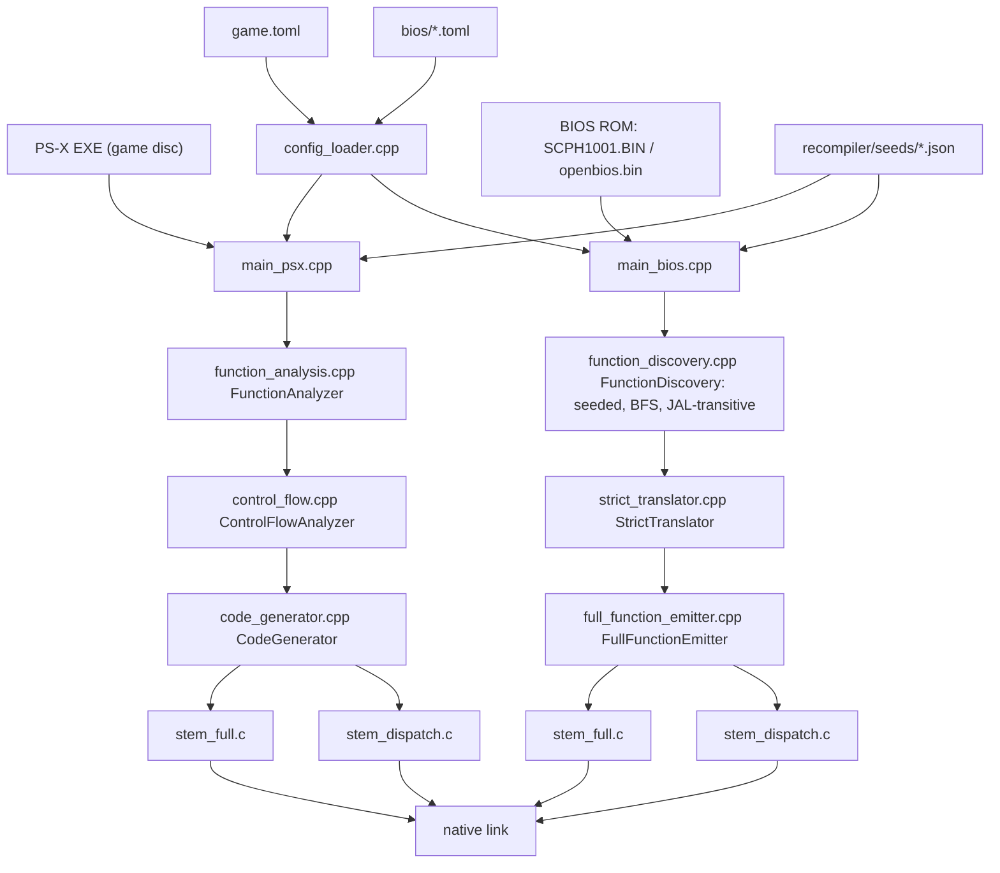

# The recompiler: MIPS → C

`recompiler/` (C++20) is an offline tool: it reads MIPS R3000A machine code —
a game's `PS-X EXE` or a flat BIOS ROM — and writes C source files under
`generated/`, which the runtime links in as native functions. See
[`./overview.md`](./overview.md) for how the recompiler and runtime trees fit
together, and [`./bios-tiers.md`](./bios-tiers.md) for what the runtime does
with the generated C.

This page covers the pipeline in detail: what goes in, how functions are
found, how MIPS becomes C, and the two output files every recompiled program
gets — including a real asymmetry the higher-level docs gloss over: the BIOS
and game paths do **not** run through the same C++ classes.

## Inputs

| Input | Game path (`psxrecomp-game`) | BIOS path (`psxrecomp-bios`) |
|---|---|---|
| Program image | `PS-X EXE` extracted from a game disc | flat ROM (`bios/SCPH1001.BIN`, `bios/openbios.bin`), loaded at `0xBFC00000` |
| Config | `game.toml` (lives in the game repo, not this one) | `bios/*.toml`, e.g. `bios/SCPH1001.toml`, `bios/OpenBIOS.toml` |
| Seeds | a seed file referenced by `game.toml`'s `[recompiler]` table | `recompiler/seeds/*.json`, e.g. `phase2_ghidra_seeds.json`, `openbios_elf_seeds.json`, `phase1c_seeds.json` |

Both binaries take `--config <path.toml>`, the going-forward invocation
(`recompiler/src/main_bios.cpp#L965`). Config loading (both BIOS and game) is
`PSXRecompV4::load_bios_config` / the game equivalent in
`recompiler/src/config_loader.cpp`
([Source · API](https://github.com/Alexbeav/psxrecomp/blob/0c4dd09a06382cc65c5e1b866fd6efdba5d77381/recompiler/src/config_loader.cpp) ·
[`../../api/config__loader_8cpp.html`](../../api/config__loader_8cpp.html)).

### `bios/*.toml` — the authoritative BIOS profile schema

`bios/SCPH1001.toml` and `bios/OpenBIOS.toml` are the schema `docs/BUILDING.md`
and `docs/COMPILING_OVERLAYS.md` actually reference. Each has `[program]`
(`name`, `id`, `rom`, `load_address`, `entry_pc`, `text_size`) and
`[recompiler]` (`seeds`, `out_dir`, `out_stem`, `strict`), plus
`[recompiler.address_model]` (`normalize_mask` and one
`[[recompiler.address_model.copy]]` block per boot-time bulk ROM→RAM code
copy the BIOS performs — `name`, `rom_lo`, `rom_hi`, `ram_lo`,
`runtime_base`, `dispatch_key`, `kernel_bless`; two copies each, at
different offsets), `[[recompiler.install_slots]]` (kernel-RAM `ram_addr`
values the BIOS overwrites at runtime with 4-instruction dispatch stubs —
SCPH1001 lists the SIO data-byte handler slot at RAM `0x00000CF0`), and
`[recompiler.runtime_exports]` (per-image anchors couriered into the
generated C for the runtime's HLE tier: `shell_entry_phys` on both profiles,
`deliver_event_ret` on SCPH1001 only — OpenBIOS's kernel-call HLE stays off
until that anchor is verified for it).

`config_loader.cpp` also accepts an optional `[[recompiler.bios_vectors]]`
array (`ram_addr`, `index_reg`, `table_rom_addr`, `table_count`,
`table_ram_addr` — a ROM-resident A0/B0/C0 jump-vector table copy) and an
optional `[[recompiler.bios_aliases]]` array (`ram_addr`, `target_key` — a
fixed-target install-at-runtime trampoline). Neither `bios/SCPH1001.toml` nor
`bios/OpenBIOS.toml` sets these; the repository root's `SCPH1001.toml` does
(e.g. a `bios_aliases` entry mapping RAM `0xCF0` to `target_key 0x641C`, the
SIO handler trampoline), in an older, simpler schema with no
`[recompiler.address_model]` or `[recompiler.runtime_exports]`. (unverified,
same caveat as [`./overview.md`](./overview.md#two-config-layers-that-are-never-merged)):
the root-level `SCPH1001.toml`/`SCPH101.toml`/`SCPH5552.toml` files aren't
referenced by `docs/BUILDING.md` or `docs/COMPILING_OVERLAYS.md`; this page
doesn't know whether they're still consumed anywhere or a stale duplicate.

## Two entry points, two discovery/codegen implementations

`docs/ARCHITECTURE.md` describes the recompiler as "two entry points sharing
the same translation core." That is true for the instruction *decoder*
(`mips_decoder.cpp` + vendored `rabbitizer`) and for a handful of shared
infrastructure files (`ps1_exe_parser.cpp`, `bios_address_model.cpp`,
`config_loader.cpp`, `recompiler_patch.cpp`, `pgxp_hook_emitter.cpp`). Past
the decoder, `recompiler/CMakeLists.txt` links the two binaries against
different discovery and codegen source files:

| | `psxrecomp-game` (`main_psx.cpp`) | `psxrecomp-bios` (`main_bios.cpp`) |
|---|---|---|
| Discovery | `function_analysis.cpp` — `PSXRecomp::FunctionAnalyzer` | `function_discovery.cpp` — `PSXRecompV4::FunctionDiscovery` |
| Control flow | `control_flow.cpp` — `PSXRecomp::ControlFlowAnalyzer` | folded into `function_discovery.cpp`'s own BFS walk |
| Codegen | `code_generator.cpp` — `PSXRecomp::CodeGenerator` | `strict_translator.cpp` (`PSXRecompV4::StrictTranslator`) + `full_function_emitter.cpp` (`PSXRecompV4::FullFunctionEmitter`) |

(Verified against `PSXRECOMP_GAME_SOURCES` and the `psxrecomp-bios`
`add_executable` list in `recompiler/CMakeLists.txt` — neither target links
the other path's discovery or codegen files.) A third file,
`recompiler/src/basic_block.cpp` (`PSXRecomp::BasicBlockAnalyzer`), defines a
second, older `BasicBlock`/analyzer pair not referenced by any
`add_executable`/`add_library` — vestigial, not part of either pipeline.

Both codegen paths still independently handle the same two coprocessor
concerns: GTE (COP2) is emitted inline in both (`code_generator.cpp`'s
`case 0x12`, `recompiler/src/code_generator.cpp#L1505`), and COP0
(MFC0/MTC0/RFE) is handled in both (`code_generator.cpp#L1482` for the game
path, `strict_translator.cpp`'s `opcode == 0x10` block for the BIOS path).

## Function discovery

### BIOS path: `FunctionDiscovery` (Phase 1c)

`recompiler/src/function_discovery.h` documents this as "Phase 1c:
deterministic function discovery pipeline." Given a set of seed addresses and
a flat ROM image, it discovers functions transitively via direct JAL targets;
each function is walked exactly once via BFS over basic blocks
(`recompiler/src/function_discovery.cpp#L692`,
[Source · API](https://github.com/Alexbeav/psxrecomp/blob/0c4dd09a06382cc65c5e1b866fd6efdba5d77381/recompiler/src/function_discovery.cpp#L692) ·
[`../../api/function__discovery_8cpp.html`](../../api/function__discovery_8cpp.html)).

Design rules from the header comment: every seed must come from an explicit
seed file (no heuristically-guessed entry points); functions are keyed by
normalized address (`addr & 0x1FFFFFFF`) and never emitted twice under the
same key; indirect jumps (`jr` on a register other than `$ra`, and `jalr`)
terminate the walk for that path and are recorded as `IndirectJumpSite`s, not
resolved; every instruction is validated through `StrictTranslator`, and an
unsupported opcode is a hard failure — no stubs, no partial output; direct
JAL targets outside the ROM range are recorded as `CallEdge`s but not walked
(they may be RAM-side copies of ROM code). Key types in the same header:
`Seed` (`address`, `label`, `rationale`), `BasicBlockInfo` (`start_addr`,
`end_addr`, `instruction_count`, `termination`, `branch_target`), and
`DiscoveredFunction` (`entry_addr`, `normalized_addr`, `end_addr`,
`instruction_count`, `termination_reason`, `discovered_by`, `block_leaders`).

`FunctionDiscovery::discover()` emits `function_manifest.json`
(per-function metadata), `function_edges.json` (caller→callee edges), and
`discovery_run.log.json` (run statistics) — written by `main_bios.cpp`'s
`run_discover()` (`recompiler/src/main_bios.cpp#L879-921`,
[Source · API](https://github.com/Alexbeav/psxrecomp/blob/0c4dd09a06382cc65c5e1b866fd6efdba5d77381/recompiler/src/main_bios.cpp) ·
[`../../api/main__bios_8cpp.html`](../../api/main__bios_8cpp.html)), plus two
Phase-1d artifacts for indirect control flow: `indirect_jumps.json` and
`indirect_jump_classes.json`. `main_bios.cpp` seeds discovery from three
sources before calling `discover()`: the seed file itself, ROM-resident
targets of any configured `bios_vectors` tables, and ROM-resident targets of
any configured `bios_aliases` trampolines (`run_emit_full()`,
`recompiler/src/main_bios.cpp#L766-865`).

### Game path: `FunctionAnalyzer`

`main_psx.cpp` uses a different, older discovery engine:
`PSXRecomp::FunctionAnalyzer` (`recompiler/include/function_analysis.h#L97`,
`analyze()` at `recompiler/src/function_analysis.cpp#L1470`,
[Source · API](https://github.com/Alexbeav/psxrecomp/blob/0c4dd09a06382cc65c5e1b866fd6efdba5d77381/recompiler/src/function_analysis.cpp) ·
[`../../api/function__analysis_8cpp.html`](../../api/function__analysis_8cpp.html)).
It is heuristic where the BIOS discoverer is strict: `FunctionAnalysisResult`
counts functions found by prologue-scanning (`prologue_count`,
`strong_prologue_count`), by following JAL call targets
(`call_discovered_count`), by recognizing packed A0/B0/C0 BIOS dispatch
thunks (`bios_thunk_count`), and by scanning executable pointer tables
(`pointer_table_entry_count`) separately. `game.toml`'s `[recompiler]` table
supplies its seed file and address model the same way `bios/*.toml` does.

This same `FunctionAnalyzer` is reused, read-only, by a separate developer
tool, `psxrecomp-analyze` (`recompiler/src/main_analyze.cpp`,
`analysis_db.cpp`, `analysis_export.cpp`, `bios_call_names.cpp`, declared in
`recompiler/include/analysis_db.h`). Per `docs/FUNCTION_DISCOVERY.md`,
`psxrecomp-analyze` is explicitly **not part of the recompilation path** —
`recompiler/CMakeLists.txt` does not link it against `runtime/` — and it may
report confidence-graded hypotheses (`verified`/`high`/`medium`/`low`/`data`)
rather than hard-failing on what it cannot prove. It produces a diagnostic
JSON/TSV bundle for humans and decompiler tooling, not C — do not confuse it
with either discovery pipeline above.

## Code generation

### Game path: `CodeGenerator`

`recompiler/include/code_generator.h` declares `struct CPUState`,
`struct CodeGenConfig`, `struct GeneratedFunction`, and `class CodeGenerator`
(`recompiler/include/code_generator.h#L249`,
[Source · API](https://github.com/Alexbeav/psxrecomp/blob/0c4dd09a06382cc65c5e1b866fd6efdba5d77381/recompiler/include/code_generator.h) ·
[`../../api/code__generator_8h.html`](../../api/code__generator_8h.html)).
`CodeGenerator::generate_function()` takes one `Function` plus its
`ControlFlowGraph` (from `control_flow.cpp`) and returns one
`GeneratedFunction`; `generate_all_functions()` runs that over every
discovered function. It also has methods for the BIOS relocation model
(`set_bios_address_model`), per-block cycle accounting
(`partial_block_cycle_count`, `emit_mid_block_cycle_charge`), interrupt
delivery points (`emit_interrupt_check`), and register naming (`reg_name`).
Every MIPS instruction the game path supports has its own
`translate_<mnemonic>` method — `translate_addiu`, `translate_lui`,
`translate_lw`, `translate_sw`, `translate_or`, `translate_sll`, and so on
through the R3000A ISA plus GTE/COP0. Two short examples:

```cpp
--8<-- "code-docs/.engine/recompiler/src/code_generator.cpp:164:190"
```

(`recompiler/src/code_generator.cpp#L164-190`,
[Source · API](https://github.com/Alexbeav/psxrecomp/blob/0c4dd09a06382cc65c5e1b866fd6efdba5d77381/recompiler/src/code_generator.cpp#L164-L190) ·
[`../../api/code__generator_8cpp.html`](../../api/code__generator_8cpp.html))

Each generated function becomes exactly one C function; `main_psx.cpp` writes
them all into one `<exe_stem>_full.c` — or, for very large EXEs, numbered
shards (`recompiler/src/main_psx.cpp#L1348` onward, "Split-TU output") — then
builds `<exe_stem>_dispatch.c`, a normalized-address → function-pointer table
used by `call_by_address()` so dynamic `jalr`/`jr` calls reach the right
compiled function (`recompiler/src/main_psx.cpp#L1453-1457`).

### BIOS path: `StrictTranslator` + `FullFunctionEmitter`

The BIOS path does not go through `CodeGenerator` at all. Per-instruction
translation is `PSXRecompV4::StrictTranslator`
(`recompiler/src/strict_translator.h#L62`,
[Source · API](https://github.com/Alexbeav/psxrecomp/blob/0c4dd09a06382cc65c5e1b866fd6efdba5d77381/recompiler/src/strict_translator.h) ·
[`../../api/strict__translator_8h.html`](../../api/strict__translator_8h.html)).
Its header comment is dated ("Phase 1a... Currently: LUI, ORI, ADDIU, SW,
SLL, J, JAL, JR, JALR, RFE") and undersells the current file —
`strict_translator.cpp` (1490 lines) dispatches on every MIPS opcode used by
the retail and OpenBIOS images, including branches, all load/store forms,
and COP0 (`MFC0`/`MTC0`/`RFE`, the `opcode == 0x10` block). Its contract is
still accurate and is the same fail-loud rule `FunctionDiscovery` relies on:
return `TranslateResult{supported=false, fail_reason=...}` for anything it
cannot translate, never a stub.

`PSXRecompV4::FullFunctionEmitter`
(`recompiler/src/full_function_emitter.h#L54`,
[Source · API](https://github.com/Alexbeav/psxrecomp/blob/0c4dd09a06382cc65c5e1b866fd6efdba5d77381/recompiler/src/full_function_emitter.cpp) ·
[`../../api/full__function__emitter_8cpp.html`](../../api/full__function__emitter_8cpp.html))
consumes a `DiscoveryResult` and the ROM image and emits both output files in
one pass (`FullFunctionEmitter::emit`,
`recompiler/src/full_function_emitter.cpp#L2299`). Per its header contract:
functions are named `func_{NORMALIZED:08X}` (physical address after KSEG
strip and ROM→RAM alias resolution); intra-function branches become `goto`
plus labels at basic-block leaders; a direct call (`JAL`) becomes a direct C
function call; an indirect call (`JALR`) or indirect jump (`JR` on a
register other than `$ra`) goes through `psx_dispatch()` — the runtime's
PC-to-function resolver described in
[`./overview.md`](./overview.md#run-time-architecture); and `JR $ra` becomes
a C `return`.

## The two output files

Both entry points produce the same pair of files per program, named from the
config's `out_stem` (`SCPH1001`, `OpenBIOS`, or a game's serial):

| File | Contents | BIOS emitter | Game emitter |
|---|---|---|---|
| `<stem>_full.c` | One C function per discovered guest function | `FullFunctionEmitter::emit` (`full_function_emitter.cpp#L2356`) | `main_psx.cpp#L1306` |
| `<stem>_dispatch.c` | Normalized address → function-pointer dispatch table | `FullFunctionEmitter::emit_dispatch` (`full_function_emitter.cpp#L1646`) | `main_psx.cpp#L1457` |

These are build artifacts, never hand-edited: `CLAUDE.md` rule 4 in this
checkout states it directly — if the generated code is wrong, the fix belongs
in the recompiler source, not in `generated/<stem>_full.c`. The BIOS emitter
also writes two smaller, conditional JSON files alongside them:
`<stem>_skipped_functions.json` (functions it could not emit, e.g. FPU) and
`<stem>_interpreted_functions.json` (functions routed to the dirty-RAM
interpreter fallback — rule 18 in this checkout's `CLAUDE.md`; see
[`./overview.md`](./overview.md#run-time-architecture)).

## The BIOS recompile path end to end

`main_bios.cpp` builds `psxrecomp-bios` and has three modes, selected by its
arguments: plain (no `--discover`/`--emit-full`/`--config`) runs the original
Phase 1a **boot-slice** path — a bounded walk of at most 4096 bytes from the
reset vector, emitting `boot_slice.c` and self-validating it with a C
compiler invoked directly (`run_boot_slice`), superseded for full BIOS work
but still reachable positionally; `--discover <seeds.json>` runs Phase 1c
discovery only (`run_discover`), writing the manifest/edges/log/indirect-jump
artifacts without emitting C; and `--config <profile.toml>` (or the legacy
`--emit-full <seeds.json>` form) runs the full pipeline — load the profile,
validate the ROM against any pinned `[program.image] sha256`, load seeds
(plus any `bios_vectors`/`bios_aliases` target seeds), run
`FunctionDiscovery::discover`, then `FullFunctionEmitter::emit`
(`run_emit_full`, `recompiler/src/main_bios.cpp#L766-865`).

`tools/regen_bios.sh --config bios/OpenBIOS.toml` (or `bios/SCPH1001.toml`,
which needs a locally supplied retail dump) is the documented way to invoke
the full pipeline (`docs/BUILDING.md`). The equivalent for a game is
`psxrecomp-game --config game.toml`, run from the game repository that links
this framework in as a submodule.

## Pipeline diagram



## Where to go next

- [`./overview.md`](./overview.md) — the recompiler/runtime split and the
  three-tier execution model the generated C feeds into.
- [`./bios-tiers.md`](./bios-tiers.md) — what the runtime does with the
  recompiled BIOS at run time (LLE baseline, optional HLE tier).
- [`./overlays.md`](./overlays.md) — the runtime feeding captured overlays
  back through this same recompiler at run time.
- [`./tools.md`](./tools.md) — `tools/regen_bios.sh`, `compile_overlays.py`,
  and the rest of the Python tooling.
- [`./reading-paths.md`](./reading-paths.md) — guided tours through the code.
