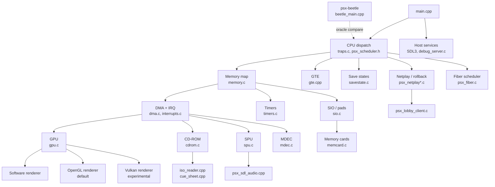

# Runtime subsystems

The runtime (`runtime/src`, `runtime/include`, C99 + C++17) links the recompiler's generated C in as native functions and simulates the rest of the PS1 around it: CPU dispatch, the memory map, and one MMIO-driven peripheral per piece of real hardware. This page is a file-by-file map — files, entry points, and where to start reading. It does **not** cover the recompiler pipeline, the overlay capture/compile/dispatch system, or the BIOS LLE/HLE split; see [`./recompiler.md`](./recompiler.md), [`./overlays.md`](./overlays.md), and [`./bios-tiers.md`](./bios-tiers.md) for those.

Source: [docs/ARCHITECTURE.md](https://github.com/Alexbeav/psxrecomp/blob/0c4dd09a06382cc65c5e1b866fd6efdba5d77381/docs/ARCHITECTURE.md).

## Component map



## CPU dispatch, scheduling, and GTE

The run loop is declared in `psx_scheduler.h` but defined in `runtime/src/traps.c`, next to the `setjmp`/`longjmp` exception-escape machinery it depends on:

```c
--8<-- "code-docs/.engine/runtime/src/traps.c:883:893"
```

`psx_is_dispatchable(uint32_t pc)` (`traps.c:101`) decides whether a PC has native code to jump to. The BIOS thread model runs on host fibers via `psx_fiber.h`/`psx_fiber.c`, a `#if defined(_WIN32)` split between Win32 Fibers and POSIX `ucontext` ([docs/ARCHITECTURE.md#L69](https://github.com/Alexbeav/psxrecomp/blob/0c4dd09a06382cc65c5e1b866fd6efdba5d77381/docs/ARCHITECTURE.md#L69)). `psx_interpreter.c` is a separate, full R3000A interpreter for oracle/comparison builds only (`stub_interpreter.c` no-ops it out natively) — not the dirty-RAM tier-3 interpreter, which is on [`./overlays.md`](./overlays.md). The GTE (geometry coprocessor) is called from inline instructions the recompiler emits into generated code ([docs/ARCHITECTURE.md#L47](https://github.com/Alexbeav/psxrecomp/blob/0c4dd09a06382cc65c5e1b866fd6efdba5d77381/docs/ARCHITECTURE.md#L47)); `gte.cpp` supplies the math those call sites invoke.

| File | Entry points | Read first |
|---|---|---|
| `psx_scheduler.h` · [Source](https://github.com/Alexbeav/psxrecomp/blob/0c4dd09a06382cc65c5e1b866fd6efdba5d77381/runtime/include/psx_scheduler.h) · [`../../api/psx__scheduler_8h.html`](../../api/psx__scheduler_8h.html) | `psx_scheduler_run`, `psx_sched_save_context`, `psx_sched_set_current_tcb`, `psx_sched_current_tcb`, `psx_is_dispatchable`, `psx_scheduler_resume_at`, rollback-netplay snapshot fns | Declarations only |
| `traps.c` · [Source · L883](https://github.com/Alexbeav/psxrecomp/blob/0c4dd09a06382cc65c5e1b866fd6efdba5d77381/runtime/src/traps.c#L883) · [`../../api/traps_8c.html`](../../api/traps_8c.html) | `psx_scheduler_run`, `psx_is_dispatchable` | The `for (;;)`/`setjmp` loop |
| `psx_fiber.h`/`.c` · [Source](https://github.com/Alexbeav/psxrecomp/blob/0c4dd09a06382cc65c5e1b866fd6efdba5d77381/runtime/src/psx_fiber.c) · [`../../api/psx__fiber_8c.html`](../../api/psx__fiber_8c.html) | `psx_fiber_create`, `psx_fiber_switch`, `psx_fiber_convert_thread`, `psx_fiber_current`, `psx_fiber_destroy` | The `_WIN32` split |
| `cpu_state.h` · [`../../api/cpu__state_8h.html`](../../api/cpu__state_8h.html) | `CPUState` struct | Registers/PC/HI-LO layout |
| `psx_interpreter.c` (oracle-only) · [`../../api/psx__interpreter_8c.html`](../../api/psx__interpreter_8c.html) | full MIPS I interpreter | Only for `psx-beetle` comparisons |
| `gte.h`/`gte.cpp` (2218 lines, C++17) · [Source](https://github.com/Alexbeav/psxrecomp/blob/0c4dd09a06382cc65c5e1b866fd6efdba5d77381/runtime/src/gte.cpp) · [`../../api/gte_8cpp.html`](../../api/gte_8cpp.html) | one fn per GTE opcode (`gte_rtps`, `gte_rtpt`, `gte_mvmva`, `gte_nclip`, `gte_avsz3`/`4`, NCS/NCDS/NCCT/DPCS/DPCL, `gte_op`, `gte_sqr`, `gte_gpf`, `gte_gpl`) + COP2 transfer (`gte_mtc2`/`mfc2`/`ctc2`/`cfc2`) | `gte_rtps_internal`, shared by RTPS/RTPT |

## Memory map, DMA, and interrupts

`psx_memory.h` defines the RAM geometry contract (`PSX_MAIN_RAM_RETAIL_BYTES` = `0x00200000`, 2 MiB, with an `0x00800000`/8 MiB expanded option gated at compile time) and KUSEG/KSEG0/KSEG1 canonicalization. `memory.c` (2216 lines) implements the bus: `psx_read_word`/`psx_write_word`/`psx_read_half`/`psx_write_half`/`psx_read_byte` each wrap a `_raw` variant behind a load/store shadow-recording hook (`g_ls_mode`) used by the accuracy/oracle tooling. DMA channels move blocks between RAM and the GPU/CD-ROM/SPU/MDEC without CPU involvement; `interrupts.c` is the single interrupt controller every peripheral below raises a line on.

| File | Entry points | Read first |
|---|---|---|
| `psx_memory.h` · [`../../api/psx__memory_8h.html`](../../api/psx__memory_8h.html) | `psx_ram_canonical_offset`, `psx_ram_resolve` | The `PSX_MAIN_RAM_*` macros |
| `memory.c` · [Source · L1493](https://github.com/Alexbeav/psxrecomp/blob/0c4dd09a06382cc65c5e1b866fd6efdba5d77381/runtime/src/memory.c#L1493) · [`../../api/memory_8c.html`](../../api/memory_8c.html) | `psx_read_word`, `psx_write_word`, `psx_read_half`, `psx_write_half`, `psx_read_byte` | `psx_read_word_raw`/`_write_word_raw` |
| `dma.h`/`dma.c` (1387 lines) · [Source](https://github.com/Alexbeav/psxrecomp/blob/0c4dd09a06382cc65c5e1b866fd6efdba5d77381/runtime/src/dma.c) · [`../../api/dma_8c.html`](../../api/dma_8c.html) | per-channel struct/MMIO | The channel your DMA bug is on |
| `interrupts.h`/`interrupts.c` (2201 lines) · [Source](https://github.com/Alexbeav/psxrecomp/blob/0c4dd09a06382cc65c5e1b866fd6efdba5d77381/runtime/src/interrupts.c) · [`../../api/interrupts_8c.html`](../../api/interrupts_8c.html) | I_STAT/I_MASK handlers | How each peripheral calls in |

## GPU

Three backends behind one interface, `gpu.h`. GP0 (render commands) and GP1 (display control) are each read *and* written through their own MMIO port:

```c
--8<-- "code-docs/.engine/runtime/include/gpu.h:18:22"
```

`gpu.c` (5824 lines) owns GPU state and GP0/GP1 command processing. `gpu_sw_renderer.c` (1868 lines) is the CPU-side software rasterizer, "the reference look." `gpu_gl_renderer.c` (4385 lines) is OpenGL, GPU-authoritative VRAM/FBO rendering, and the *default* — it falls back to software if GL init fails. `gpu_vk_renderer.c` (3319 lines) is experimental Vulkan: `PSX_ENABLE_VULKAN` defaults **ON** (built when SDK tools are present) but Vulkan is not the runtime's default renderer — it also needs the game to offer a Vulkan path and the user to request it, else the runtime falls back to OpenGL ([docs/ARCHITECTURE.md#L144](https://github.com/Alexbeav/psxrecomp/blob/0c4dd09a06382cc65c5e1b866fd6efdba5d77381/docs/ARCHITECTURE.md#L144)).

| File | Entry points | Read first |
|---|---|---|
| `gpu.h` · [`../../api/gpu_8h.html`](../../api/gpu_8h.html) | `gpu_init`, `gpu_read_gpustat`, `gpu_read_gpuread`, `gpu_write_gp0`, `gpu_write_gp1`, `gpu_vblank_tick`, `gpu_get_vram`, `gpu_get_display_info`, `gpu_video_standard_is_pal` | The contract all three backends implement |
| `gpu.c` (5824 lines) · [Source · L2696](https://github.com/Alexbeav/psxrecomp/blob/0c4dd09a06382cc65c5e1b866fd6efdba5d77381/runtime/src/gpu.c#L2696) · [`../../api/gpu_8c.html`](../../api/gpu_8c.html) | `gpu_init`, GP0/GP1 dispatch | `gpu_init`, then the GP0 opcode switch |
| `gpu_sw_renderer.c` (1868 lines) · [Source](https://github.com/Alexbeav/psxrecomp/blob/0c4dd09a06382cc65c5e1b866fd6efdba5d77381/runtime/src/gpu_sw_renderer.c) · [`../../api/gpu__sw__renderer_8c.html`](../../api/gpu__sw__renderer_8c.html) | polygon/line/sprite rasterizers | Whichever primitive you're chasing |
| `gpu_gl_renderer.c` (4385 lines, default) · [Source](https://github.com/Alexbeav/psxrecomp/blob/0c4dd09a06382cc65c5e1b866fd6efdba5d77381/runtime/src/gpu_gl_renderer.c) · [`../../api/gpu__gl__renderer_8c.html`](../../api/gpu__gl__renderer_8c.html) | GL setup/teardown, FBO VRAM | `docs/internal/GL_RENDERER_HANDOFF.md` |
| `gpu_vk_renderer.c` (3319 lines, experimental) · [Source](https://github.com/Alexbeav/psxrecomp/blob/0c4dd09a06382cc65c5e1b866fd6efdba5d77381/runtime/src/gpu_vk_renderer.c) · [`../../api/gpu__vk__renderer_8c.html`](../../api/gpu__vk__renderer_8c.html) | Vulkan device/swapchain | Only if working the Vulkan path |
| `gpu_render.c`, `gpu_vram_dirty.c`, `gpu_uv.h`, `gpu_sw_edges.h`, `gpu_vk_upload.h` · [`../../api/gpu__render_8c.html`](../../api/gpu__render_8c.html) | shared helpers | Once inside one of the renderers above |

## CD-ROM

`cdrom.h`: `cdrom_init` mounts a `.cue`, `cdrom_replace_disc` hot-swaps it, `cdrom_has_disc` reports whether anything mounted (BIOS-only boots leave it empty, non-fatally), `cdrom_set_disc_scex` sets the region SCEX string, `cdrom_notify_game_started` applies configured disc-speed post-BIOS, and `cdrom_get_setloc_lba` reads the pending seek target.

| File | Entry points | Read first |
|---|---|---|
| `cdrom.h` · [`../../api/cdrom_8h.html`](../../api/cdrom_8h.html) | `cdrom_init`, `cdrom_replace_disc`, `cdrom_has_disc`, `cdrom_set_disc_scex`, `cdrom_notify_game_started`, `cdrom_get_setloc_lba` | Whole header — it's short |
| `cdrom.c` (3589 lines) · [Source · L2749](https://github.com/Alexbeav/psxrecomp/blob/0c4dd09a06382cc65c5e1b866fd6efdba5d77381/runtime/src/cdrom.c#L2749) · [`../../api/cdrom_8c.html`](../../api/cdrom_8c.html) | `cdrom_init`, drive command state machine | `cdrom_init`, then the CD command you're tracing |
| `iso_reader.cpp`/`iso_reader_c.cpp` · [`../../api/iso__reader_8cpp.html`](../../api/iso__reader_8cpp.html) | disc-image sector reads | Disc-format bugs |
| `cue_sheet.cpp` · [`../../api/cue__sheet_8cpp.html`](../../api/cue__sheet_8cpp.html) | `.cue` parsing | Multi-track/audio-CD titles |
| `disc_identity.cpp`, `disc_path.cpp` · [`../../api/disc__identity_8cpp.html`](../../api/disc__identity_8cpp.html) | serial/region detection, path resolution | Game-detection issues |

## SIO, controllers, and pads

`sio.h` models the single SIO0 shift-register bus controllers and memory cards share: `sio_init`, `sio_read`/`sio_write` for guest MMIO (internal helpers skip the hardware side effects — the guest bus must never use those), `sio_tick`/`sio_advance` for cycle-driven timing, `sio_set_multitap`.

| File | Entry points | Read first |
|---|---|---|
| `sio.h` · [`../../api/sio_8h.html`](../../api/sio_8h.html) | `sio_init`, `sio_read`, `sio_write`, `sio_tick`, `sio_advance`, `sio_set_multitap` | The multitap/analog opt-in comments |
| `sio.c` (3163 lines) · [Source · L936](https://github.com/Alexbeav/psxrecomp/blob/0c4dd09a06382cc65c5e1b866fd6efdba5d77381/runtime/src/sio.c#L936) · [`../../api/sio_8c.html`](../../api/sio_8c.html) | `sio_init`, the shift-register state machine | `sio_init`, then `sio_read`/`sio_write` |
| `controller_policy.c`, `controller_port_route.c` · [`../../api/controller__policy_8c.html`](../../api/controller__policy_8c.html) | port/pad policy | Multi-controller routing bugs |
| `psx_keybinds.c`, `psx_stick.c`, `host_keymap.c` · [`../../api/psx__keybinds_8c.html`](../../api/psx__keybinds_8c.html) | host input → guest pad mapping | Keybinding/stick issues |

## Save cards and save states

Two distinct systems: **memory cards** (`memcard.h`) are a virtual PS1 device on the SIO bus — `memcard_init`/`memcard_init_slots` mount a card, `memcard_read_sector`/`memcard_write_sector` are the 128-byte sector accessors, `memcard_flush`/`memcard_flush_all` commit to disk, and `memcard_export_raw`/`memcard_import_raw` move a whole `.mcd`/`.mcr` image. **Save states** (`savestate.h`) are a host-side snapshot of the whole machine, unrelated to guest hardware: `savestate_configure` sets the target directory and integrity tag, `savestate_write_slot`/`savestate_read_slot` are the save/load pair, `savestate_capture_thumb`/`savestate_read_thumb` handle thumbnails, and `savestate_admission.c` gates cross-version loads.

| File | Entry points | Read first |
|---|---|---|
| `memcard.h` · [`../../api/memcard_8h.html`](../../api/memcard_8h.html) | `memcard_init`, `memcard_read_sector`, `memcard_write_sector`, `memcard_flush`, `memcard_export_raw`/`import_raw` | Whole header |
| `memcard.c` · [Source · L216](https://github.com/Alexbeav/psxrecomp/blob/0c4dd09a06382cc65c5e1b866fd6efdba5d77381/runtime/src/memcard.c#L216) · [`../../api/memcard_8c.html`](../../api/memcard_8c.html) | `memcard_init` | A sector read/write pair |
| `savestate.h` · [`../../api/savestate_8h.html`](../../api/savestate_8h.html) | `savestate_configure`, `savestate_write_slot`, `savestate_read_slot` | Whole header |
| `savestate.c` (1137 lines) · [Source · L649](https://github.com/Alexbeav/psxrecomp/blob/0c4dd09a06382cc65c5e1b866fd6efdba5d77381/runtime/src/savestate.c#L649) · [`../../api/savestate_8c.html`](../../api/savestate_8c.html) | `savestate_write_slot`, `savestate_read_slot` | `savestate_configure`, then a write/read pair |
| `savestate_admission.c` · [`../../api/savestate__admission_8c.html`](../../api/savestate__admission_8c.html) | slot-compatibility gating | Cross-version save-loading issues |

## Timers and cycle scheduling

`timers.h` models the PS1's three hardware timers: `timers_init`, `timers_read`/`timers_write` for MMIO, `timers_advance(uint32_t cycles)`/`timers_tick(int cycles)` to move them forward. The CPU-cycle counter timers and SIO key off of is `psx_cycle_count` (`psx_cycles.h`/`.c`) with an inline fast path `psx_advance_cycles()` — confirmed present and used by `bios_hle.c`/`boot_state.c`, not just proposed. A larger cycle-driven scheduler unifying SIO/timer/IRQ timing under one deadline model is **(unverified — design proposal per docs/CYCLE_TIMING_ARCH.md, explicitly "Status: design proposal. No code committed against this doc yet.")** and does not describe the code above.

| File | Entry points | Read first |
|---|---|---|
| `timers.h` · [`../../api/timers_8h.html`](../../api/timers_8h.html) | `timers_init`, `timers_read`, `timers_write`, `timers_advance`, `timers_tick` | Whole header |
| `timers.c` (357 lines) · [Source · L73](https://github.com/Alexbeav/psxrecomp/blob/0c4dd09a06382cc65c5e1b866fd6efdba5d77381/runtime/src/timers.c#L73) | `timers_init` | `timers_init`, then `timers_advance` |
| `psx_cycles.h` · [`../../api/psx__cycles_8h.html`](../../api/psx__cycles_8h.html) | `psx_cycle_count`, inline `psx_advance_cycles`, `psx_get_cycle_count` | The inline fast path, then `psx_advance_cycles_slow` |

## SPU and MDEC

**SPU** (`spu.h`): `spu_init`, `spu_render(int16_t* out_stereo, int frames)` mixes the current audio block, `spu_read`/`spu_write` are voice/register MMIO, `spu_dma_write`/`spu_dma_read` are the DMA-channel-4 path in/out of SPU RAM, `spu_get_voice_state` exposes per-voice state, `spu_cd_audio_push` feeds CD-DA into the mix. **MDEC** (`mdec.h`), the FMV decoder: `mdec_init`, `mdec_read`/`mdec_write` for MMIO, `mdec_dma_write_word`/`mdec_dma_read_word` for single-word DMA, `mdec_dma_write_words`/`mdec_dma_read_words` for bulk transfer, `mdec_get_decode_count` for diagnostics.

| File | Entry points | Read first |
|---|---|---|
| `spu.h` · [`../../api/spu_8h.html`](../../api/spu_8h.html) | `spu_init`, `spu_render`, `spu_read`/`write`, `spu_dma_write`/`read`, `spu_get_voice_state`, `spu_cd_audio_push` | Whole header |
| `spu.c` (1824 lines) · [Source · L950](https://github.com/Alexbeav/psxrecomp/blob/0c4dd09a06382cc65c5e1b866fd6efdba5d77381/runtime/src/spu.c#L950) · [`../../api/spu_8c.html`](../../api/spu_8c.html) | `spu_init`, `spu_render` | `spu_init`, then `spu_render`'s per-voice mix loop |
| `spu_shadow.c`, `spu_gauss.h` · [`../../api/spu__shadow_8c.html`](../../api/spu__shadow_8c.html) | shadow/oracle recording, Gaussian resampling table | Accuracy-tooling or resampling work only |
| `mdec.h` · [`../../api/mdec_8h.html`](../../api/mdec_8h.html) | `mdec_init`, `mdec_read`/`write`, `mdec_dma_write_word(s)`/`read_word(s)`, `mdec_get_decode_count` | Whole header |
| `mdec.c` (1209 lines) · [Source · L794](https://github.com/Alexbeav/psxrecomp/blob/0c4dd09a06382cc65c5e1b866fd6efdba5d77381/runtime/src/mdec.c#L794) · [`../../api/mdec_8c.html`](../../api/mdec_8c.html) | `mdec_init` | `mdec_init`, then a DMA word-transfer pair |

## Netplay and rollback

Gated behind CMake option `PSX_NETPLAY` (OFF by default, per [docs/BUILDING.md](https://github.com/Alexbeav/psxrecomp/blob/0c4dd09a06382cc65c5e1b866fd6efdba5d77381/docs/BUILDING.md)), which links `recomp-net` and the lobby client. `psx_netplay.c` (4902 lines) is real when `PSX_HAS_RECOMP_NET` is defined; confirmed by grep, when it is **not** defined the same file compiles a stub block instead (`#if !defined(PSX_HAS_RECOMP_NET)`, from line 387) where `psx_netplay_active()` and friends just return 0/"none":

```c
--8<-- "code-docs/.engine/runtime/src/psx_netplay.c:387:392"
```

`psx_netplay_rb.c` (9747 lines) is the rollback implementation; `psx_netplay_sched.c` (237 lines) integrates it with scheduling. For protocol/topology depth, read [docs/NETPLAY.md](https://github.com/Alexbeav/psxrecomp/blob/0c4dd09a06382cc65c5e1b866fd6efdba5d77381/docs/NETPLAY.md) and [docs/NETPLAY_TOPOLOGY.md](https://github.com/Alexbeav/psxrecomp/blob/0c4dd09a06382cc65c5e1b866fd6efdba5d77381/docs/NETPLAY_TOPOLOGY.md) in the checkout rather than here.

| File | Read first |
|---|---|
| `psx_netplay.c` (4902 lines) · [Source · L389](https://github.com/Alexbeav/psxrecomp/blob/0c4dd09a06382cc65c5e1b866fd6efdba5d77381/runtime/src/psx_netplay.c#L389) · [`../../api/psx__netplay_8c.html`](../../api/psx__netplay_8c.html) | `psx_netplay_active` — check which side of the `#if` you're building |
| `psx_netplay_rb.c` (9747 lines) · [Source](https://github.com/Alexbeav/psxrecomp/blob/0c4dd09a06382cc65c5e1b866fd6efdba5d77381/runtime/src/psx_netplay_rb.c) · [`../../api/psx__netplay__rb_8c.html`](../../api/psx__netplay__rb_8c.html) | `docs/NETPLAY.md` first — this file is large |
| `psx_netplay_sched.c` (237 lines) · [`../../api/psx__netplay__sched_8c.html`](../../api/psx__netplay__sched_8c.html) | Scheduler-integration hooks |
| `psx_lobby_client.c` · [`../../api/psx__lobby__client_8c.html`](../../api/psx__lobby__client_8c.html) | Matchmaking/session handshake |
| `netplay_input_hist.c`, `netplay_snap_ring.c`, `netplay_state_digest.c` · [`../../api/netplay__input__hist_8c.html`](../../api/netplay__input__hist_8c.html) | Input history ring, snapshot ring, state-hash confirmation |

## Host services and the oracle binary

Window/input/audio use SDL3 by default (`PSX_SDL_BACKEND=SDL3`); `-DPSX_SDL_BACKEND=SDL2` is an explicit compatibility fallback ([docs/BUILDING.md](https://github.com/Alexbeav/psxrecomp/blob/0c4dd09a06382cc65c5e1b866fd6efdba5d77381/docs/BUILDING.md)). `host_time.c`, `host_osd.c`, `psx_sdl_audio.cpp`, `psx_window_icon.cpp` are the small host-glue files. `main.cpp` (14990 lines, `main()` at line 11250) is where the game boots, config resolves, and the overlay/code-provider backend is chosen — too large to read linearly; grep for `code_provider_active`, `overlay_backend_resolve`, `psx_bios_hle_configure`. The optional debug TCP server (`debug_server_init(int port)`) is gated by `PSX_DEBUG_TOOLS` (ON for Debug/RelWithDebInfo, OFF for Release).

`psx-beetle` (`beetle_main.cpp`, `beetle_debug_server.c`, `beetle_libretro.cpp`) is a separate binary wrapping the Beetle PSX (mednafen-psx) libretro core, run as its own process on debug port 4380 alongside `psx-runtime`'s 4370 for instruction-level correctness comparison. It is a development oracle, not part of a shipped game.

| File | Entry points | Read first |
|---|---|---|
| `main.cpp` (14990 lines) · [Source · L11250](https://github.com/Alexbeav/psxrecomp/blob/0c4dd09a06382cc65c5e1b866fd6efdba5d77381/runtime/src/main.cpp#L11250) · [`../../api/main_8cpp.html`](../../api/main_8cpp.html) | `main` | Grep for the symbol you need |
| `debug_server.h`/`.c` · [`../../api/debug__server_8c.html`](../../api/debug__server_8c.html) | `debug_server_init` | Only for the TCP debug protocol |
| `beetle_main.cpp` · [Source · L67](https://github.com/Alexbeav/psxrecomp/blob/0c4dd09a06382cc65c5e1b866fd6efdba5d77381/runtime/src/beetle_main.cpp#L67) · [`../../api/beetle__main_8cpp.html`](../../api/beetle__main_8cpp.html) | `main` | Only when chasing an oracle-parity mismatch |

## Where to go next

- [`./recompiler.md`](./recompiler.md) — the MIPS→C pipeline that produces the code this page's dispatch layer runs.
- [`./overlays.md`](./overlays.md) — capture, compile, cache, dispatch, and the dirty-RAM interpreter.
- [`./bios-tiers.md`](./bios-tiers.md) — LLE baseline vs. the optional HLE tier.
- [`./reading-paths.md`](./reading-paths.md) — guided tours through the code.
