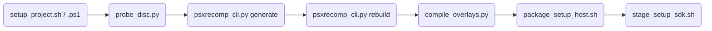

# Tools

This is a reference page: what each pipeline tool does, its flags, and how the
tools chain together. All of them are Python or shell/PowerShell scripts, so
there are no Doxygen API links here (Doxygen covers the C/C++ recompiler and
runtime, not the tooling).

The pipeline, at a glance:



Scaffold a title repo, probe the disc for identity/seeds, generate BIOS + game
C, build the runtime, compile captured overlays into the shard cache at play
time, then package a setup-host release zip. Every stage is also reachable
standalone — a title with a repo already scaffolded starts at `generate`.

## `psxrecomp_cli.py` (repo root)

The Generate & rebuild CLI. It is **not** under `tools/` — it lives at the
game-repo submodule root (`psxrecomp/psxrecomp_cli.py`) so it can be invoked
as `python3 psxrecomp/psxrecomp_cli.py <command>` from a title checkout. It
is the CLI contract documented in
[`docs/LOCAL_CODEGEN_SDK.md`](https://github.com/Alexbeav/psxrecomp/blob/0c4dd09a06382cc65c5e1b866fd6efdba5d77381/docs/LOCAL_CODEGEN_SDK.md)
for `recomp-ui` setup flows and RetComM launcher automation.

Argument parsing is built by
[`build_parser()`](https://github.com/Alexbeav/psxrecomp/blob/0c4dd09a06382cc65c5e1b866fd6efdba5d77381/psxrecomp_cli.py#L1874),
each subcommand dispatches to a `cmd_*` handler, and
[`main()`](https://github.com/Alexbeav/psxrecomp/blob/0c4dd09a06382cc65c5e1b866fd6efdba5d77381/psxrecomp_cli.py#L2097)
is the entry point.

| Command | Handler | Role |
|---|---|---|
| `verify-disc` | [`cmd_verify_disc`](https://github.com/Alexbeav/psxrecomp/blob/0c4dd09a06382cc65c5e1b866fd6efdba5d77381/psxrecomp_cli.py#L880) | Verify disc digests against `game.toml` |
| `generate` | [`cmd_generate`](https://github.com/Alexbeav/psxrecomp/blob/0c4dd09a06382cc65c5e1b866fd6efdba5d77381/psxrecomp_cli.py#L950) | Regenerate BIOS backends + prepare disc + generate game C |
| `rebuild` | [`cmd_rebuild`](https://github.com/Alexbeav/psxrecomp/blob/0c4dd09a06382cc65c5e1b866fd6efdba5d77381/psxrecomp_cli.py#L1503) | CMake build (+ optional local PGO) |
| `ensure-toolchain` | [`cmd_ensure_toolchain`](https://github.com/Alexbeav/psxrecomp/blob/0c4dd09a06382cc65c5e1b866fd6efdba5d77381/psxrecomp_cli.py#L1689) | Download/unpack `cmake-clang-v1` into the shared toolchain cache |
| `ensure-emitters` | [`cmd_ensure_emitters`](https://github.com/Alexbeav/psxrecomp/blob/0c4dd09a06382cc65c5e1b866fd6efdba5d77381/psxrecomp_cli.py#L1718) | Build `psxrecomp-game` + `psxrecomp-bios` when missing |
| `analyze` | [`cmd_analyze`](https://github.com/Alexbeav/psxrecomp/blob/0c4dd09a06382cc65c5e1b866fd6efdba5d77381/psxrecomp_cli.py#L1741) | Static function discovery over the boot EXE (no runtime involved) |
| `pgo-train` | [`cmd_pgo_train`](https://github.com/Alexbeav/psxrecomp/blob/0c4dd09a06382cc65c5e1b866fd6efdba5d77381/psxrecomp_cli.py#L1683) | Force a PGO rebuild + train + use cycle |

Supporting functions worth knowing when reading the source: `find_psxrecomp_game`,
`find_psxrecomp_bios`, `find_emitters`, `ensure_emitters`, `ensure_analyzer`,
`ensure_framework`, `bios_backend_present`, `regen_bios_profile`,
`verify_disc_path`, `run_prepare_disc`, `run_pgo_train`, `_cmake_configure`/`_cmake_build`.

### `generate` and `rebuild` flags

The `generate` subcommand's own argument registration:

```python title="psxrecomp_cli.py (build_parser)"
--8<-- "code-docs/.engine/psxrecomp_cli.py:1889:1916"
```

| Flag | Command | Meaning |
|---|---|---|
| `--config` | all | `game.toml` path (default `game.toml`) |
| `--project-root` | all | game project root |
| `--json-progress` | all | emit JSONL progress events on stdout |
| `--disc` | `generate`, `rebuild` | source dump / working cue or bin |
| `--bios` | `generate` | optional retail BIOS dump, staged as `bios/SCPH1001.BIN` and regenerated |
| `--force-bios` | `generate` | regenerate OpenBIOS even if `generated/` backends already exist |
| `--skip-hash-check` | `verify-disc`, `generate` | skip digest verification |
| `--force-prepare` | `generate` | re-run disc normalization even if already prepared |
| `--force-emitters` | `generate` | rebuild `psxrecomp-game`/`psxrecomp-bios` even if binaries exist |
| `--no-toolchain-download` | `generate`, `rebuild` | do not fetch `cmake-clang-v1` when emitters/toolchain are missing |
| `--build-dir` | `rebuild`, `pgo-train` | CMake build directory (required) |
| `--target` | `rebuild`, `pgo-train` | CMake target (default `psx-runtime`) |
| `--no-pgo` / `--force-pgo` | `rebuild` | skip or force PGO regardless of `[pgo] enabled` in `game.toml` |
| `--train-secs` / `--train-runs` | `rebuild`, `pgo-train` | override `[pgo]` train duration/run count |
| `--prune-after` | `rebuild` | comma list of `toolchain,build-intermediates,build-tree,all` to free disk after success |

`generate` normalizes the dump via `tools/prepare_disc.py` when needed, then
runs `psxrecomp-game --config game.toml` into `[recompiler] out_dir`.
`rebuild` runs CMake; when `[pgo] enabled = true` (and `--no-pgo` is not
set) it instruments, trains, then rebuilds with the resulting profiles.

### Exit codes

| Code | Constant | Meaning |
|---|---|---|
| 0 | `EXIT_OK` | success |
| 1 | `EXIT_ERROR` | runtime / generation / build failure |
| 2 | `EXIT_USAGE` | usage / argument error |
| 3 | `EXIT_VERIFY` | disc verification failure |

Verified against the constants at
[`psxrecomp_cli.py#L37-L40`](https://github.com/Alexbeav/psxrecomp/blob/0c4dd09a06382cc65c5e1b866fd6efdba5d77381/psxrecomp_cli.py#L37).

### `--json-progress` event types

Per `docs/LOCAL_CODEGEN_SDK.md`, stdout is reserved for one JSON object per
line when this flag is set:

| `event` | Notes |
|---|---|
| `phase` | `verify`, `prepare_disc`, `emit`, `build`, `pgo_*`, `done` |
| `disc` | digests after verification |
| `log` | mirrored tool chatter |
| `result` | final payload |
| `error` | carries `message` and `code` |

## `tools/compile_overlays.py`

Compiles captured overlay bytes into a native shard cache (DLL, or a single
static binary in `--static`/B-2 mode) that the runtime dispatches into on
later visits. The overlay capture → compile → cache → dispatch story is
covered in depth on [`./overlays.md`](./overlays.md); this table is a flag
reference only.

| Flag | Meaning |
|---|---|
| `--captures` | `overlay_captures.json` from the runtime; optional, since the runtime normally injects `PSX_OVERLAY_CAPTURES` (only required for manual/offline invocation) |
| `--game-toml` | `game.toml` (for `game_id`); required |
| `--recompiler` | path to `psxrecomp-game.exe`; required |
| `--runtime-include` | path to the psxrecomp `runtime/include` dir; required |
| `--project-root` | root the recompiler resolves the BIOS profile against; usually inferred from `--runtime-include` |
| `--out-dir` | cache root dir (default `build-dev/cache`) |
| `--gcc` | GCC binary (default `gcc`) |
| `--compiler` | `gcc` (default, best-optimized) or `tcc` (bundled toolchain-free fallback; shards land in a separate `tcc/` cache namespace) |
| `--tcc` | TinyCC binary, used when `--compiler tcc` |
| `--force` | recompile even if output already exists |
| `--only-region` | compile only captures whose normalized load address matches (repeatable; manual validation aid) |
| `--check` | preflight: build every shard into a throwaway temp dir (implies `--force`, never touches the real cache); exits non-zero if a shard that should build fails |
| `--force-interior` | also compile a specific virtual/physical PC as an isolated interior fragment (repeatable; diagnostic recovery) |
| `--static` | B-2 mode: compile into `overlays_static.c` for binary linking instead of a DLL |
| `--flavor` | codegen flavor id baked into `overlay_abi()` (0 = base/master; widescreen builds pass 1) |
| `--cps` | continuation-passing: sets `PSX_CPS` for the recompiler invocation; must match the runtime build |
| `--jobs` | parallel region-group workers (default: cores − 2; `--static` always runs sequential) |

Key functions, for readers going into the source: `codegen_ver`, `overlay_abi_tag`,
`codegen_hash`, `verify_recompiler_matches_tag`, `overlay_config_hash`,
`ShardStats`, `patch_generated_c`/`patch_generated_c_static`,
`generate_overlay_dispatch`, `write_overlay_ranges`, `load_shard_func_ids` — see
[`./overlays.md`](./overlays.md) for what these do in the pipeline.

## `tools/new_project_layout/`

Scaffolds a new title repo onto the current root-level
`psxrecomp/` + `recomp-ui/` submodule layout, and migrates older layouts onto
it. Documented in
[`docs/GAME_PROJECT_SETUP.md`](https://github.com/Alexbeav/psxrecomp/blob/0c4dd09a06382cc65c5e1b866fd6efdba5d77381/docs/GAME_PROJECT_SETUP.md).

| Script | Role |
|---|---|
| `setup_project.sh` | Linux/macOS interactive/CI scaffold: repo stubs, submodules, packager stub, optional CI workflow, disc probe, optional Generate + build, optional `gh repo create` + push |
| `setup_project.ps1` | Windows equivalent of `setup_project.sh` |
| `probe_disc.py` | Standalone disc probe: from a Redump `.cue` writes `game.toml`, `seeds/ghidra_funcs.txt`, `catalog_identity.json`, `disc_probe.json`, and (via `sync_symbols.py`) `symbols.toml` + `psx_symbols.h` |
| `fetch_boxart.py` | Fetches PS1 boxart (PNG + launcher TGA) from libretro-thumbnails, by name, tried against multiple mirror URLs |
| `fill_tokens.py` | Replaces `@TOKEN@` placeholders (and CI `YOUR_*` tokens) in scaffold/template files |
| `sync_symbols.py` | Syncs root `symbols.toml` into `psx_symbols.h` (`PSX_FN_*` macros) |
| `migrate_project.py` | Project Studio CLI entry point: `audit` / `plan` / `apply` / `ops` / `gui` (delegates to `project_studio/cli.py`) |
| `project_studio_gui.py` | GUI front end for Project Studio, per its own docstring a CustomTkinter app that auto-bootstraps a `.venv` from `requirements-gui.txt` on first run — invoked as `migrate_project.py gui` |
| `project_studio/` | Shared detect/plan/ops library used by `migrate_project.py` and the GUI |

`migrate_project.py`'s subcommands are implemented in `project_studio/cli.py`,
which also registers `repos` and `updates` subcommands beyond the
`audit`/`plan`/`apply`/`ops`/`gui` set `docs/GAME_PROJECT_SETUP.md` documents
(unverified as pipeline-relevant — treated here as internal to Project Studio).

```bash
python3 tools/new_project_layout/migrate_project.py audit --root ~/src/ApeEscapeRecomp
python3 tools/new_project_layout/migrate_project.py plan  --root ~/src/ApeEscapeRecomp
python3 tools/new_project_layout/migrate_project.py apply --root ~/src/ApeEscapeRecomp --dry-run
```

Typical apply order (per `docs/GAME_PROJECT_SETUP.md`): rename the old
framework submodule, emit `codegen_setup`, rewrite CMake to
`psxrecomp_add_game_runtime` + wizard, add the setup-host packager + CI,
optionally re-run `probe_disc` / pins. `apply` always enables recomp-ui and
the setup wizard; netplay stays opt-in.

### `probe_disc.py` standalone flags

```bash
python3 tools/new_project_layout/probe_disc.py disc/game.cue \
  --write-game-toml game.toml \
  --write-catalog catalog_identity.json \
  --write-seeds seeds/ghidra_funcs.txt \
  --disc-rel disc/game.cue --out-dir disc --players 2
```

Also confirmed in source: `--json-out` (full probe dump) and
`--description`/`--publisher`/`--year`/`--region` (marketing fields for
`catalog_identity.json` and the README).

## `tools/ci/`

CI composite-action scripts, referenced from
`docs/GAME_PROJECT_SETUP.md`'s "Shared tools" table and used by the
framework's own `.github/actions/*`.

| Script | Role |
|---|---|
| `normalize_version.sh` | Normalizes `vX.Y.Z` (or computes the next semver from git tags/`VERSION`) into `VERSION=…` / `TAG=…` |
| `clear_generated.sh` | Wipes `generated/` so CI can build a BIOS-free setup host |
| `record_pins.sh` | Prints pinned submodule revisions for CI logs |
| `build_emitters.sh` | Configures and builds `psxrecomp-game` + `psxrecomp-bios`; prefers the portable `cmake-clang-v1` pack on Windows CI |
| `vendor_deps.sh` | Stages pinned third-party dependency archives; `--check` verifies what is staged without downloading anything |
| `prefetch_sdl3.sh` | Prefetches the pinned SDL3 source tree for CMake `FetchContent`, working around an intermittent GitHub Actions HTTP/2 download failure |
| `verify_pins.sh` | Optional local check: fails if checkout SHAs disagree with a committed `framework_pins.txt`; release CI does not run this (submodule gitlinks are authoritative) |

## Other named pipeline tools (`tools/` top level)

Referenced by `docs/BUILDING.md`, `docs/GAME_PROJECT_SETUP.md`, or
`docs/FUNCTION_DISCOVERY.md`, and confirmed present in this checkout.

| Tool | Role |
|---|---|
| `regen_bios.sh` | Canonical regeneration of BIOS generated C from a `bios/*.toml` profile; also records an emitter fingerprint so the runtime CMake build can warn on drift |
| `prepare_disc.py` | Normalizes a PS1 disc dump to MODE2/2352 `.bin`/`.cue`; called by `psxrecomp_cli.py generate` |
| `overlay_xref.py` | Mines the runtime's capture set for overlay cross-references — dynamic evidence, used for widescreen cull-site discovery and overlay bring-up; distinct from the static `analyze` command (per `docs/FUNCTION_DISCOVERY.md`) |
| `fetch_toolchain.sh` | Downloads and unpacks a `retcomm-toolchains` `cmake-clang-v1` pack |
| `toolchain_pack.py` | CLI: resolve/download/unpack a `cmake-clang-v1` pack into `toolchain/` and the shared cache |
| `stage_setup_sdk.sh` | Stages emitters, the OpenBIOS surface, and an optional portable toolchain into an existing setup-host release stage directory |
| `bundle_mingw_dlls.sh` | Windows: copies MinGW runtime DLLs (walking an exe and its copied DLLs transitively) next to a Windows PE |
| `package_setup_host.sh` | Universal setup-host zip packager: stages the host exe, title sources, and filtered `psxrecomp/`/`recomp-ui/`, then finishes via `stage_setup_sdk.sh` |
| `setup_dev.sh` | One-shot Linux/macOS dev environment bootstrap: builds the CLI/recompiler from source and refreshes generated BIOS C if `bios/SCPH1001.BIN` is present |

`docs/BUILDING.md`'s TombaRecomp example references a `tools/extract_psx_exe.py`
from "the game's repository, not this one" — that script does **not** exist
under this checkout's `tools/`, so it is a downstream game repo's own script,
not part of this framework's tooling.

### Release/packaging and manual test helpers

| Tool | Role |
|---|---|
| `package_release.ps1` | Packages this framework's own BIOS-only runtime build (Windows) |
| `package_release_macos.sh` | Generic macOS counterpart to `package_release.ps1`; game repos call it directly instead of duplicating packaging logic |
| `create_release_zip.py` | Zips a staged directory with sorted POSIX-style entry names (works around `Compress-Archive` writing backslash path separators) |
| `click_launcher.ps1` | Manual test helper: synthesizes a left-click at client coordinates in the running `psx-runtime` launcher window, optional screenshot |
| `shot_launcher.ps1` | Manual test helper: screenshots the `psx-runtime` launcher window client area |
| `launch_tomba2_interp_perf.ps1` | Title-specific (Tomba 2) interpreter performance test launcher; not a general pipeline tool |

## Everything else under `tools/`

`tools/` also holds roughly 150 additional single-purpose debug,
trace-analysis, and reverse-engineering scripts (mostly `_`-prefixed —
`_dump_state6.py`, `_check_gate.py`, `_pad_txns.py`, … — plus non-underscore
ones like `analyze_sio.py`, `decode_jtable.py`, `gte_audit.py`, `pad_trace.py`,
`sio_compact.py`, `wtrace_filter.py`) that accumulated during bring-up of
specific titles. They are not part of the documented build/release pipeline
above and are not documented individually here — browse `tools/` directly if
you need one.

## See also

- [`./overview.md`](./overview.md) — the three-tier execution model these tools feed.
- [`./overlays.md`](./overlays.md) — the capture/compile/cache pipeline `compile_overlays.py` implements.
- [`./recompiler.md`](./recompiler.md) — what the emitters these tools invoke actually do.
- [`./reading-paths.md`](./reading-paths.md) — guided tours through the code.
