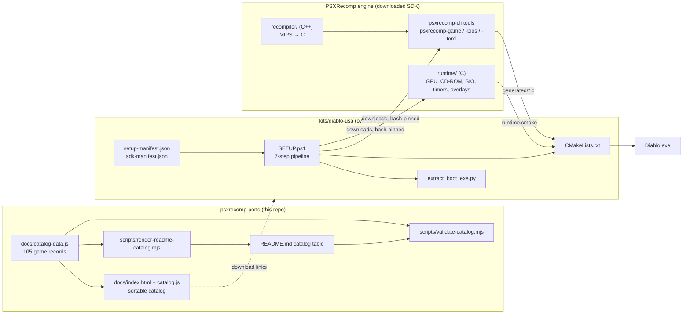

# PSXRecomp Ports — code guide

This site exists so that you can **read the code through the documentation**:
every page explains one part of the system, embeds the real source it talks
about, and links into a generated API reference with syntax-highlighted
listings, call graphs, and include graphs.

[Open the API reference](api/index.html){ .md-button .md-button--primary }
[Start with the ports overview](ports/overview.md){ .md-button }
[Start with the engine overview](engine/overview.md){ .md-button }

## Two code bases, one site

| Part | What it is | Language | Size |
|---|---|---|---|
| **psxrecomp-ports** (this repository) | The public release catalog: a sortable GitHub Pages table of every port, the scripts that keep the README and the page in sync, and one *owned-input kit* (Diablo, USA) showing how a release turns a player's own disc and BIOS into a native executable. | JavaScript, PowerShell, Python, CMake | ~1,000 lines |
| **PSXRecomp engine** | The static recompiler and runtime the kits download at setup time: MIPS R3000A machine code is translated to C ahead of time, compiled to x64, and linked against a PS1 hardware runtime. | C, C++, Python | ~300,000 lines |

The engine is documented at the commit pinned in `code-docs/engine-pin.json`
(public head of Alexbeav/psxrecomp on 2026-08-31). The Diablo kit's manifest
pins a runtime commit that is not on the public history, so treat the engine
pages as "the closest public tree", not the exact bytes the kit builds.

## How the pieces fit

## Where to go

- **[Ports overview](ports/overview.md)** — the repository map and how the catalog, scripts, and kit relate.
- **[Kit setup pipeline](ports/kit-setup.md)** — the PowerShell script that verifies inputs, downloads pinned tools, generates code, and builds the game. This is the bridge into the engine.
- **[Engine overview](engine/overview.md)** — the three execution tiers (static, native overlay, interpreter), the build-time and run-time architecture.
- **[Reading paths](engine/reading-paths.md)** — guided orders for "how a frame is drawn", "how a disc boots", "how an overlay becomes native code".
- **[Building these docs](building.md)** — regenerate the site locally or in CI.

## Reading the API reference

The reference (Doxygen + Graphviz) is the place to read code line by line:

- *Files* in its sidebar lists every source file with a highlighted listing where each identifier links to its definition.
- Each function page draws a **call graph** (what it calls) and a **caller graph** (what calls it).
- Each file page draws its **include graph**; each directory page draws a **dependency graph**.

PowerShell and JavaScript are not native Doxygen languages. Small line-preserving
filters in `code-docs/filters/` translate them so their functions and call
graphs appear; the listings show the original files.
