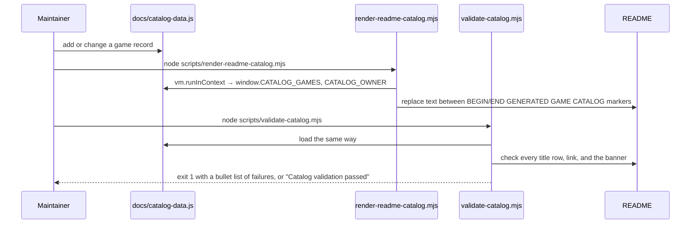

# Catalog scripts

Two Node scripts (ES modules, no dependencies) keep the README and the site in
agreement with `docs/catalog-data.js`. Both use the same trick to read a
browser-only data file: they create a `vm` context with a fake `window` object
and run the file inside it.



## `render-readme-catalog.mjs`

API reference: [render-readme-catalog.mjs](../../api/render-readme-catalog_8mjs.html)

Builds one Markdown table row per game, sorted by title with the same numeric
collation the page uses, and splices the result between two HTML comment
markers in `README.md`. A second, legacy regular expression recognises the
pre-marker README layout so the first run on an old README still works.

```js linenums="1"
--8<-- "scripts/render-readme-catalog.mjs"
```

## `validate-catalog.mjs`

API reference: [validate-catalog.mjs](../../api/validate-catalog_8mjs.html)

Collects failures into a list instead of throwing on the first one, so a single
run reports everything wrong. The checks, in order:

1. `CATALOG_OWNER` has `owner`, `repository`, and `pagesUrl`.
2. Every game has the required fields, a unique slug and title, a positive
   integer player count, and zero or two screenshots that exist on disk.
3. Every release URL starts with `<repository>/releases/download/` and the
   repository is under the configured owner.
4. The README contains the details link and every release link for the game.
5. The README row count equals the number of games.
6. `index.html` links both scripts, has the table body, and shows the banner
   before the intro; the README shows the banner too.

```js linenums="1"
--8<-- "scripts/validate-catalog.mjs"
```

## Running them

```bash
node scripts/render-readme-catalog.mjs && node scripts/validate-catalog.mjs
```

There is no `package.json`; Node 18 or newer is enough.
