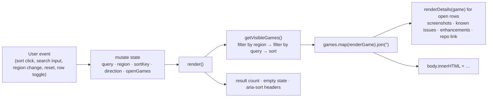

# Catalog site (`docs/catalog.js`)

The catalog page is plain HTML plus one dependency-free script. `index.html`
provides the table skeleton, toolbar, and two `<script>` tags; `catalog-data.js`
defines the data; `catalog.js` renders everything into `<tbody id="catalog-body">`.

API reference: [catalog.js](../../api/catalog_8js.html) ·
Source: [docs/catalog.js](https://github.com/alexbeavs-ps1-ports/psxrecomp-ports/blob/main/docs/catalog.js)

## The data contract

`catalog-data.js` sets two globals on `window`:

- `CATALOG_OWNER` — `{ owner, repository, pagesUrl }`. Both Node scripts read
  this so moving the fleet to another GitHub organisation is a one-line change.
- `CATALOG_GAMES` — an array of game records. Each record has the fields the
  validator requires (`slug`, `title`, `region`, `serial`, `bios`, `players`,
  `playersLabel`, `windows`, `images`) plus optional `discs`, `repository`,
  `linux`, `macosArm64`, `macosX64`, `knownIssues`, `enhancements`.

```js title="docs/catalog-data.js, lines 11–27" linenums="11"
--8<-- "docs/catalog-data.js:11:27"
```

`images` is a list of `[path, alt]` pairs relative to `screenshots/v0.2.0/`;
the validator insists on zero or exactly two.

## Render cycle

The script is one IIFE. It captures DOM nodes once, keeps a small `state`
object, and re-renders the whole table body from scratch on every change.
There is no virtual DOM and no incremental update: with ~100 rows,
`innerHTML` replacement is fast enough and keeps the code short.



### State

```js linenums="17"
--8<-- "docs/catalog.js:17:23"
```

### Escaping

Every string that reaches `innerHTML` goes through `escapeHtml`, including
URLs used in `href` attributes. This is what keeps the page safe even though the
data file is checked in by hand.

```js linenums="25"
--8<-- "docs/catalog.js:25:30"
```

### Sorting

`compareGames` compares by the active key. Numbers (player count) compare
numerically; strings use an `Intl.Collator` with `numeric: true`, so "Tony
Hawk's Pro Skater 2" sorts before "… 3" and before "… 10". Region sorts by its
group ("USA" from "USA (English/French/German/Swedish)") and ties fall back to
title.

```js linenums="55"
--8<-- "docs/catalog.js:55:71"
```

### Filtering

```js linenums="73"
--8<-- "docs/catalog.js:73:84"
```

### A row

Each visible game becomes one `<tr class="game-row">`, and, when its slug is in
`state.openGames`, a second `<tr class="details-row">` with screenshots and
notes. The title cell is a `<button>` carrying `aria-expanded` and
`aria-controls`, so the disclosure is keyboard- and screen-reader-friendly.

```js linenums="129"
--8<-- "docs/catalog.js:129:148"
```

## Deep links

Opening a row writes `#slug` into the URL with `history.replaceState`; loading
the page with a hash opens that row and scrolls it into view. The README
catalog links to `pagesUrl#slug`, which is how the two stay connected.

```js linenums="207"
--8<-- "docs/catalog.js:207:234"
```

## Test hook

`window.CatalogTest = { compareGames, getVisibleGames, state }` exposes the
pure parts for a browser console or a future test runner. Nothing in the
repository consumes it yet.

## Things to know before editing

- `index.html` cache-busts both scripts with `?v=` query strings. Bump them when
  you change the files, or GitHub Pages visitors keep the old version.
- The region `<select>` options are hard-coded in `index.html`; adding a region
  to the data means adding an option there too. The validator does not check
  this.
- `screenshotBase` still points at `Alexbeav/psxrecomp-ports` on GitHub raw,
  not at `CATALOG_OWNER`. Screenshots keep working only while that repository
  exists.
