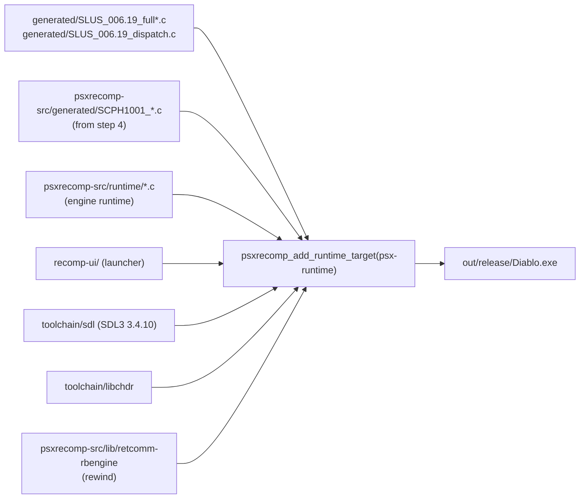

# Kit build and manifests

Besides the two scripts, the kit is configuration: a CMake project that
describes how to link generated C into the engine runtime, two JSON manifests
that pin inputs and tools, and three runtime configuration files copied next to
the built executable.

## `CMakeLists.txt`

```cmake linenums="1"
--8<-- "kits/diablo-usa/CMakeLists.txt"
```

The whole build is one call to `psxrecomp_add_runtime_target()`, defined in
the engine's `runtime/runtime.cmake`, which `include()` pulls in from the
downloaded framework. The kit passes:

| Argument | Value | Meaning |
|---|---|---|
| `GAME_GENERATED_FULL_C` | glob of `generated/SLUS_006.19_full*.c` | Function bodies emitted by `psxrecomp-game`. Split across several files so the compiler can parallelise. |
| `GAME_GENERATED_DISPATCH_C` | `generated/SLUS_006.19_dispatch.c` | The address-to-function table. |
| `WINDOW_TITLE`, `EXE_NAME` | "Diablo Recompiled", `Diablo` | Host window title and output file name. |
| `GAME_VERSION` | `0.3.4` | Shown by the launcher. |
| `DEFAULT_GAME_CONFIG_PATH` | `game.toml` | Where the runtime looks for the game config when `--game` is not given. |

The cache variables above the include select the BIOS backend: exactly one
stem, `SCPH1001`, with its profile `bios/SCPH1001.toml` from the framework.
`PSX_RECOMP_UI` and `PSX_REWIND` are forced on, `PSX_NETPLAY` off. How the
engine consumes these is covered in [Runtime subsystems](../engine/runtime.md)
and [BIOS tiers](../engine/bios-tiers.md).



## `setup-manifest.json`

```json linenums="1"
--8<-- "kits/diablo-usa/setup-manifest.json"
```

| Field | Used by | Purpose |
|---|---|---|
| `title`, `release`, `exe_basename` | `SETUP.ps1` | Messages, the built file name, `PLAY.bat`. |
| `boot_path`, `boot_exe_sha256` | `extract_boot_exe.py`, `SETUP.ps1` | Which file to pull from the disc and the only accepted revision. |
| `bios_stem`, `bios_label`, `bios_sha256` | `SETUP.ps1` | BIOS file naming, the dialog title, the accepted dump, and which Ghidra seed file to copy. |
| `runtime_commit`, `runtime_base`, `ui_commit`, `rollback_commit` | humans | Provenance: which engine, launcher, and rewind-engine commits the SDK archives were cut from. `runtime_commit` is not on the public engine history; see `code-docs/engine-pin.json`. |
| `openbios` | humans | `false`: this kit does not ship or accept OpenBIOS. |

## `sdk-manifest.json`

Every downloadable tool is one object with the same shape:

| Key | Meaning |
|---|---|
| `url` | Where `curl` fetches it. All PSXRecomp pieces come from the `Alexbeav/psxrecomp-ports` GitHub release for `v0.2.3`; Python, SDL, WinLibs, and libchdr from their upstream releases. |
| `label` | Human-readable name for progress messages. |
| `archive` | File name in the local cache. |
| `required` | Paths that must exist after extraction, or the install is rejected. |
| `sha256` | The pin. Downloads that do not match are deleted. |
| `archive_root` | Top-level folder inside the archive to promote to the destination, or `null`. |

```json linenums="27"
--8<-- "kits/diablo-usa/sdk-manifest.json:27:51"
```

The eight artifacts and where `SETUP.ps1` puts them:

| Manifest key | Destination | Contents |
|---|---|---|
| `codegen` | `psxrecomp-cli/` | `libexec/psxrecomp-game.exe`, `psxrecomp-bios.exe`, `psxrecomp-toml.exe` — the recompiler, built from `recompiler/`. |
| `framework` | `psxrecomp-src/` | The runtime SDK: `runtime/`, `bios/*.toml`, seeds, with OpenBIOS filtered out. |
| `ui` | `recomp-ui/` | The shared launcher and in-game UI (unbranded). |
| `rbengine` | `psxrecomp-src/lib/retcomm-rbengine/` | The rollback/rewind engine. |
| `sdl` | `toolchain/sdl/` | SDL3 source, built as part of the CMake project. |
| `libchdr` | `toolchain/libchdr/` | CHD disc image reader. |
| `winlibs` | `toolchain/winlibs/` or the shared space-free location | GCC 16.1, Ninja, CMake. |
| `python` | `toolchain/python/` | Embeddable Python 3.13, only when none is on `PATH`. |

## Runtime configuration files

Copied into `out/release/` in step 7 and read by the executable at start:

- **`game.toml`** — the per-title recompiler and runtime configuration that
  `psxrecomp-game --config game.toml` reads in step 5 and the runtime reads
  through `--game`. The engine's `docs/config_schema.md` documents every key.

```toml linenums="1"
--8<-- "kits/diablo-usa/game.toml"
```

- **`settings.toml`** — player-facing runtime settings (renderer, scaling,
  audio). This is the only `settings.toml` not ignored by `.gitignore`.
- **`keybinds.ini`**, **`input.ini`** — default keyboard and controller maps
  consumed by the launcher UI.
