# Disc extractor (`extract_boot_exe.py`)

Step 2 of setup needs the game's boot executable (`SLUS_006.19`) as a file.
Rather than ship it, the kit reads it out of the player's own disc image. The
extractor is 111 lines of standard-library Python that understands just enough
of CUE sheets and ISO 9660 to find one file in the root directory.

API reference: [extract_boot_exe.py](../../api/extract__boot__exe_8py.html) ·
Source: [kits/diablo-usa/extract_boot_exe.py](https://github.com/alexbeavs-ps1-ports/psxrecomp-ports/blob/main/kits/diablo-usa/extract_boot_exe.py)

## What it has to know

A PS1 disc is a CD-ROM XA disc. The CUE sheet names the BIN file(s) and the
track modes. Data tracks come in three layouts, and the extractor maps each to
a sector size and the byte offset of the 2048-byte user data inside it:

| CUE track mode | Sector size on disc | Offset of user data | Why |
|---|---|---|---|
| `MODE1/2048` | 2048 | 0 | Cooked: user data only. |
| `MODE1/2352` | 2352 | 16 | Raw: 12-byte sync + 4-byte header first. |
| `MODE2/2352` | 2352 | 24 | Raw XA: sync + header + 8-byte sub-header. Nearly all PS1 dumps. |

```mermaid
flowchart LR
    cue["CUE sheet"] -->|"FILE … BINARY<br/>TRACK nn MODEx/size"| track["data track BIN<br/>sector size, data offset"]
    track -->|"LBA 16"| pvd["Primary Volume Descriptor<br/>bytes 0–6 = 01 'CD001' 01"]
    pvd -->|"bytes 156.."| rootrec["root directory record<br/>extent LBA @2..6, size @10..14"]
    rootrec --> dir["root directory sectors"]
    dir -->|"scan records for<br/>SLUS_006.19;1"| filerec["file record → extent, size"]
    filerec --> bytes["read size bytes from extent"]
    bytes --> sha["SHA-256 == manifest.boot_exe_sha256?"]
    sha -->|yes| out["write input/SLUS_006.19"]
    sha -->|no| err["exit 3: unsupported disc revision"]
```



## The code

### Constants and CUE parsing

```python linenums="16"
--8<-- "kits/diablo-usa/extract_boot_exe.py:16:38"
```

The first data track wins; audio tracks (`AUDIO`) do not match the regular
expression and are skipped. A multi-file CUE (one BIN per track) works because
the `FILE` line before the track sets `current_file`.

### Sector and directory-record helpers

```python linenums="41"
--8<-- "kits/diablo-usa/extract_boot_exe.py:41:52"
```

`extent` reads the little-endian halves of the ISO 9660 both-endian fields:
the extent location at bytes 2–5 and the data length at bytes 10–13 of a
directory record.

### Finding the file in the root directory

```python linenums="55"
--8<-- "kits/diablo-usa/extract_boot_exe.py:55:77"
```

Directory records never cross a sector boundary; a zero length byte means
"padding to the end of this sector", which is why the loop jumps to the next
2048-byte boundary instead of stopping. Names are compared upper-case with the
`;1` version suffix already appended by the caller.

### Main

```python linenums="80"
--8<-- "kits/diablo-usa/extract_boot_exe.py:80:107"
```

Exit codes: `2` for bad usage, `3` for a disc whose executable does not match
the manifest hash, and whatever `SystemExit(message)` yields (1) for structural
errors. `SETUP.ps1` treats any non-zero code as "disc executable verification
failed".

## Limits, by design

- Only the root directory is searched. PS1 boot executables live there.
- No CHD support here; the Wave 3/4 compiled setup programs accept CHD, this
  older kit does not.
- No handling of `INDEX`/`PREGAP`; the extent arithmetic assumes the data
  track starts at LBA 0 of its BIN file, which holds for Redump single-track
  data dumps.
