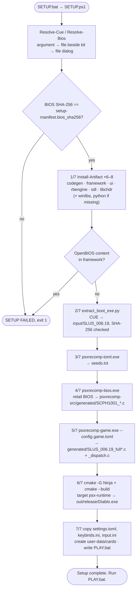
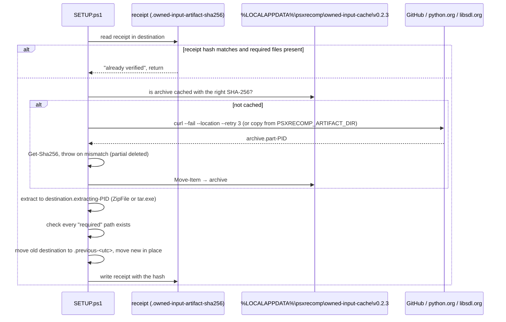

# Kit setup pipeline (`SETUP.ps1`)

`SETUP.bat` is an eleven-line launcher that runs `SETUP.ps1` with the
execution policy bypassed. The PowerShell script is the whole kit: it turns a
player's disc dump and BIOS dump into a native executable in seven numbered
steps, downloading every tool it needs from a hash-pinned manifest.

API reference: [SETUP.ps1](../../api/_s_e_t_u_p_8ps1.html) ·
Source: [kits/diablo-usa/SETUP.ps1](https://github.com/alexbeavs-ps1-ports/psxrecomp-ports/blob/main/kits/diablo-usa/SETUP.ps1)

## The seven steps



Everything runs inside one `try`/`catch` with `$ErrorActionPreference = "Stop"`,
so any failing native tool (checked through `$LASTEXITCODE`) or thrown string
ends the run with a red `SETUP FAILED:` line and exit code 1. A transcript of
the whole session is appended to `setup.log`.

## Parameters and layout

```powershell linenums="1"
--8<-- "kits/diablo-usa/SETUP.ps1:1:32"
```

Two manifests drive the run: `setup-manifest.json` (what this title needs: the
boot file name and hash, the BIOS name and hash, the executable name) and
`sdk-manifest.json` (where each tool comes from and its SHA-256). See
[Kit build and manifests](kit-build.md).

The WinLibs toolchain refuses to link from a path containing spaces. If the kit
was extracted under such a path, the compiler goes to a shared, space-free
location under `%PUBLIC%\Documents\PSXRecomp\owned-input-toolchains`, keyed by
the first twelve characters of its hash.

## Helper functions

| Function | Lines | Purpose |
|---|---|---|
| `Get-Sha256` | 34–41 | Stream a file through .NET's SHA-256 and return the upper-case hex digest. |
| `Assert-KitPath` | 43–50 | Throw unless a path resolves inside the extracted kit. Every destructive file operation goes through this or the next one. |
| `Assert-ManagedPath` | 52–60 | The same check against an arbitrary root (used for the shared toolchain location). |
| `Find-App` | 62–69 | Locate an executable on `PATH` or at listed fallbacks (`curl.exe`, `tar.exe`, `python.exe`). |
| `Select-InputFile` | 71–81 | WinForms open-file dialog; cancelling throws, which ends setup cleanly. |
| `Resolve-Cue`, `Resolve-Bios` | 83–96 | Argument, then a single file beside the kit, then the dialog. |
| `Install-Artifact` | 98–173 | Download, verify, extract, and install one pinned artifact. The core of step 1. |
| `Find-Toolchain` | 175–196 | Return `gcc`, `g++`, `ninja`, and `cmake` paths from `-Mingw` or the installed WinLibs, or `$null`. |

### `Install-Artifact`



```powershell linenums="98"
--8<-- "kits/diablo-usa/SETUP.ps1:98:173"
```

Points worth noticing:

- Downloads are content-addressed by the manifest hash, so re-running setup
  after a failure never re-downloads a good archive.
- `PSXRECOMP_ARTIFACT_DIR` lets a tester point at local copies of the archives
  without changing the manifest; the hash check still applies.
- A previous install is renamed, not deleted, so a bad upgrade is recoverable.

## The main body, step by step

### Inputs and step 1: pinned build inputs

```powershell linenums="198"
--8<-- "kits/diablo-usa/SETUP.ps1:198:244"
```

The "SDK safety gate" at lines 241–244 refuses to continue if the downloaded
framework contains OpenBIOS content. This kit is retail-BIOS-only by design;
the check makes sure the filtered SDK archive really is filtered.

### Steps 2–5: extract, seed, and generate code

```powershell linenums="246"
--8<-- "kits/diablo-usa/SETUP.ps1:246:275"
```

- Step 2 runs the [disc extractor](kit-extractor.md); the PS-X EXE must hash to
  `boot_exe_sha256` or setup stops with "unsupported disc revision".
- Step 3 asks `psxrecomp-toml.exe` for function seed addresses in the boot
  executable. In the engine this is `recompiler/src/main_toml.cpp`.
- Step 4 recompiles the retail BIOS ROM to C with `psxrecomp-bios.exe`, using
  the engine's `bios/SCPH1001.toml` profile and the Ghidra seed file it copies
  into `recompiler/seeds`. Output lands in the framework's `generated/`.
- Step 5 recompiles the game with `psxrecomp-game.exe --config game.toml`,
  producing `generated/SLUS_006.19_full*.c` and `SLUS_006.19_dispatch.c`, the
  two files `CMakeLists.txt` globs.

See [Recompiler](../engine/recompiler.md) for what happens inside those tools.

### Step 6: build the native runtime

```powershell linenums="277"
--8<-- "kits/diablo-usa/SETUP.ps1:277:305"
```

The CMake cache is inspected first: if the compiler recorded in
`CMakeCache.txt` is not the one found now, the old build directory is renamed
aside so CMake does not fail on a stale cache. The configure line pins the
compiler, Ninja, the SDL3 and libchdr source trees (through
`FETCHCONTENT_SOURCE_DIR_*`, so CMake's FetchContent never touches the
network), disables the system SDL3 search, hands over the Python interpreter,
and sets three engine options: debug tools off, launcher UI on, rewind on.

### Step 7: stage configuration and launcher

```powershell linenums="307"
--8<-- "kits/diablo-usa/SETUP.ps1:307:331"
```

`PLAY.bat` starts the executable with `--game game.toml --disc <cue>
--memcard-dir <saves> --launcher`. The runtime side of those flags is in the
engine's `runtime/src/main.cpp`; see [Runtime subsystems](../engine/runtime.md).
