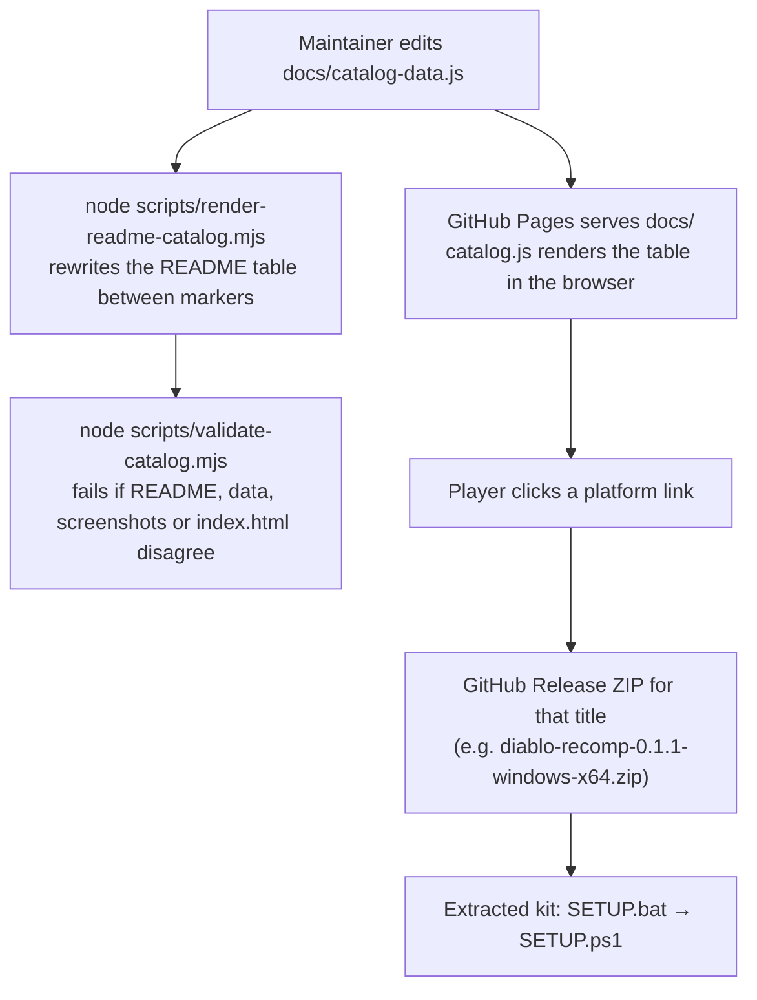

# Ports repository overview

`psxrecomp-ports` is the **public release catalog** for Alexbeav's PlayStation
recompilation ports. It ships no game data and no engine source. It holds three
things:

| Area | Files | Role |
|---|---|---|
| **Catalog site** | `docs/index.html`, `docs/catalog.css`, `docs/catalog.js`, `docs/catalog-data.js` | A static GitHub Pages site: a sortable, filterable table of 105 titles with per-platform download links, screenshots, and known issues. `docs/` is served as the site root, which is why the code documentation lives in `code-docs/` instead. |
| **Catalog scripts** | `scripts/validate-catalog.mjs`, `scripts/render-readme-catalog.mjs` | Node scripts that treat `catalog-data.js` as the single source of truth: one regenerates the README table, the other checks every link, slug, screenshot, and README row. |
| **Owned-input kit** | `kits/diablo-usa/*` | One complete example of a release package: the PowerShell setup pipeline, a Python disc extractor, a CMake project, and the manifests that pin every downloaded tool by SHA-256. |

Everything else is assets: `screenshots/v0.2.0/` (two JPEGs per title), the
banner under `docs/assets/`, and the licences.

## Data flow between the three areas

The kit in `kits/diablo-usa` is the v0.3.4 Windows package for Diablo (USA),
kept in the repository so the setup logic is reviewable. Current Wave 3 and
Wave 4 releases use a compiled setup program instead of `SETUP.bat`, but the
pipeline they run is the same seven steps described in
[Kit setup pipeline](kit-setup.md).

## What the kit does, in one paragraph

A kit contains **no disc data, no BIOS, and no generated game code**. The player
supplies a Redump CUE/BIN dump of the disc and a dump of the matching retail
BIOS. Setup verifies both by SHA-256, downloads the PSXRecomp code generators,
the runtime SDK, the launcher UI, a C toolchain (WinLibs GCC), SDL3, libchdr,
and an embeddable Python, each pinned to a hash in `sdk-manifest.json`. It then
extracts the PS-X EXE from the disc, derives function seed addresses, recompiles
the retail BIOS and the game executable to C on the player's machine, builds a
native `Diablo.exe` with CMake and Ninja, and writes a `PLAY.bat` launcher.

## Pages in this section

- [Catalog site](catalog-site.md) — how `catalog.js` renders, sorts, filters, and deep-links the table.
- [Catalog scripts](catalog-scripts.md) — the README renderer and the validator.
- [Kit setup pipeline](kit-setup.md) — `SETUP.ps1`, function by function.
- [Disc extractor](kit-extractor.md) — `extract_boot_exe.py`, an ISO 9660 reader in 111 lines.
- [Kit build and manifests](kit-build.md) — `CMakeLists.txt`, the two manifests, and the runtime configuration files.

## Source and API links

| File | Source | API reference |
|---|---|---|
| `docs/catalog.js` | [GitHub](https://github.com/alexbeavs-ps1-ports/psxrecomp-ports/blob/main/docs/catalog.js) | [catalog.js](../../api/catalog_8js.html) |
| `scripts/validate-catalog.mjs` | [GitHub](https://github.com/alexbeavs-ps1-ports/psxrecomp-ports/blob/main/scripts/validate-catalog.mjs) | [validate-catalog.mjs](../../api/validate-catalog_8mjs.html) |
| `scripts/render-readme-catalog.mjs` | [GitHub](https://github.com/alexbeavs-ps1-ports/psxrecomp-ports/blob/main/scripts/render-readme-catalog.mjs) | [render-readme-catalog.mjs](../../api/render-readme-catalog_8mjs.html) |
| `kits/diablo-usa/SETUP.ps1` | [GitHub](https://github.com/alexbeavs-ps1-ports/psxrecomp-ports/blob/main/kits/diablo-usa/SETUP.ps1) | [SETUP.ps1](../../api/_s_e_t_u_p_8ps1.html) |
| `kits/diablo-usa/extract_boot_exe.py` | [GitHub](https://github.com/alexbeavs-ps1-ports/psxrecomp-ports/blob/main/kits/diablo-usa/extract_boot_exe.py) | [extract_boot_exe.py](../../api/extract__boot__exe_8py.html) |
